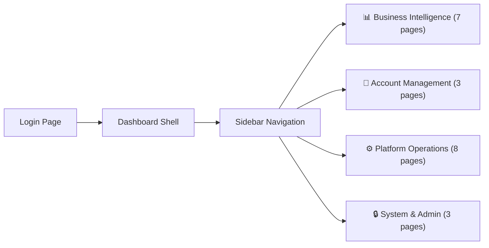

# Super Admin Dashboard — Complete UI Flow & Implementation Plan

> Deep analysis of all 66 analytics metrics, 47 admin controls + 22 additional write actions (67 total write actions), mapped to concrete pages, components, and backend APIs based on the RentSpace Prisma schema (27 models, 40 enums). Includes Alerts Center, Cohort Analysis, Churn Risk Prediction, and full admin intervention capabilities.

---

## 🏗️ Dashboard Architecture Overview

The dashboard is a **web application** (Next.js 14) with a **sidebar navigation** that organizes everything into **4 mega-sections**, containing **22 pages total** + a global Alerts system + all 30 addon features integrated.



---

## 📐 Page Hierarchy & Navigation Structure

```
🔐 Login
│
├── 📊 BUSINESS INTELLIGENCE
│   ├── 🏠 Overview Dashboard          ← Landing page after login
│   ├── 🚨 Alerts Center               ← Centralized action items & critical alerts
│   ├── 📈 Growth Analytics            ← Now includes Cohort Analysis tab
│   ├── 💰 Revenue & Billing
│   ├── 📋 Subscription Analytics
│   ├── 🏢 Platform Analytics          ← Properties + Tenants + Maintenance + Move-Out + 5 addon tabs
│   └── 📑 Reports                     ← Custom Report Builder (ADDON #20)
│
├── 👥 ACCOUNT MANAGEMENT
│   ├── 👤 Landlords (Accounts)        ← Table → Profile drill-down
│   ├── 👥 Users                        ← All platform users
│   └── 💳 Plans & Subscriptions       ← Plan CRUD + subscription controls
│
├── ⚙️ PLATFORM OPERATIONS
│   ├── 💵 Rent Management             ← Monthly overview, payments, overdue
│   ├── 🏠 Properties                   ← Platform-wide property browser
│   ├── 👤 Tenants                      ← Platform-wide tenant data + document view
│   ├── 🔧 Maintenance Ops             ← View/manage queries across platform
│   ├── 🚪 Move-Out Ops                ← View/approve/decline requests
│   ├── 📩 Support & Suggestions       ← Tickets + feature requests
│   ├── 🔔 Notifications               ← Broadcast + delivery + engagement
│   └── 👷 Staff Overview              ← All staff + permissions audit
│
└── 🔒 SYSTEM & ADMIN
    ├── 👤 Admin Users & Audit Logs
    └── ⚙️ System Settings              ← Feature flags, modules, health, geo, integrations
```

---

## 🗂️ Backend Module Structure

All new dashboard API code goes inside the **existing `src/modules/admin/`** folder as subfolders:

```
src/modules/admin/
├── admin.controller.ts           ← EXISTING (admin user CRUD)
├── admin.routes.ts               ← EXISTING (mount point for sub-routers)
├── admin.service.ts              ← EXISTING (admin user logic)
├── admin.types.ts                ← EXISTING
├── admin.validation.ts           ← EXISTING
│
├── analytics/                    ← NEW SUBFOLDER
│   ├── analytics.routes.ts       ← GET /admin/api/analytics/*
│   ├── analytics.controller.ts
│   ├── analytics.service.ts      ← Growth, revenue, cohort, platform queries
│   └── analytics.validation.ts   ← Date range, period, groupBy Zod schemas
│
├── platform/                     ← NEW SUBFOLDER
│   ├── platform.routes.ts        ← GET/PATCH /admin/api/platform/*
│   ├── platform.controller.ts
│   ├── platform.service.ts       ← Accounts, users, rent, properties, tenants ops
│   └── platform.validation.ts
│
├── alerts/                       ← NEW SUBFOLDER
│   ├── alerts.routes.ts          ← GET/PATCH /admin/api/alerts/*
│   ├── alerts.controller.ts
│   ├── alerts.service.ts         ← Alert generation, resolution
│   └── alerts.validation.ts
│
├── reports/                      ← NEW SUBFOLDER
│   ├── reports.routes.ts         ← POST /admin/api/reports/*
│   ├── reports.controller.ts
│   ├── reports.service.ts        ← Report generation, export
│   └── reports.validation.ts
│
├── notifications/                ← NEW SUBFOLDER
│   ├── admin-notification.routes.ts  ← Broadcast, templates, recall
│   └── admin-notification.service.ts
│
└── shared/                       ← NEW SUBFOLDER
    ├── pagination.util.ts        ← Shared paginated response wrapper
    ├── analytics-cache.util.ts   ← Redis caching layer for analytics
    └── analytics-base.service.ts ← Shared GROUP BY / COUNT query helpers
```

**Route mounting in `app.ts`:**
```typescript
// Existing admin routes
app.use("/admin/api", adminRoutes);
app.use("/admin/api/plans", planRoutes);
app.use("/admin/api/subscriptions", subscriptionRoutes);
app.use("/admin/api/system", adminSystemRoutes);

// NEW dashboard routes (import from admin subfolders)
app.use("/admin/api/analytics", analyticsRoutes);
app.use("/admin/api/platform", platformRoutes);
app.use("/admin/api/alerts", alertsRoutes);
app.use("/admin/api/reports", reportsRoutes);
app.use("/admin/api/notifications", adminNotifRoutes);
```

> [!NOTE]
> **Zero risk to existing mobile app APIs** — all new code is inside `admin/` subfolders and mounted under `/admin/api/*`. Existing `/api/v1/*` routes remain untouched.

---

## 🗂️ Frontend Project Structure

```
rentspace-dashboard/
├── src/
│   ├── app/                          ← Next.js App Router
│   │   ├── (auth)/login/             ← Page 1: Login
│   │   ├── (dashboard)/              ← Protected pages
│   │   │   ├── overview/             ← Page 2
│   │   │   ├── alerts/               ← Page 3
│   │   │   ├── growth/               ← Page 4
│   │   │   ├── revenue/              ← Page 5
│   │   │   ├── subscriptions/        ← Page 6
│   │   │   ├── platform/             ← Page 7 (9 tabs)
│   │   │   ├── accounts/             ← Page 8
│   │   │   ├── users/                ← Page 9
│   │   │   ├── plans/                ← Page 10
│   │   │   ├── rent/                 ← Page 11
│   │   │   ├── properties/           ← Page 12
│   │   │   ├── tenants/              ← Page 13
│   │   │   ├── maintenance/          ← Page 14
│   │   │   ├── move-outs/            ← Page 15
│   │   │   ├── support/              ← Page 16
│   │   │   ├── notifications/        ← Page 17
│   │   │   ├── admin-users/          ← Page 18
│   │   │   ├── staff/                ← Page 19
│   │   │   ├── settings/             ← Page 20
│   │   │   ├── reports/              ← Page 21
│   │   │   └── layout.tsx            ← Dashboard shell (sidebar + header)
│   │   └── layout.tsx                ← Root layout
│   ├── components/
│   │   ├── ui/                       ← Shadcn/UI components
│   │   ├── charts/                   ← Recharts wrappers
│   │   ├── tables/                   ← TanStack Table wrappers
│   │   └── shared/                   ← KPI cards, alert badges, etc.
│   ├── hooks/                        ← Custom React hooks
│   ├── lib/                          ← API client, auth, utils
│   ├── types/                        ← TypeScript interfaces (mirrors Prisma)
│   └── stores/                       ← Zustand stores
├── public/
├── tailwind.config.ts
├── tsconfig.json
└── package.json
```

---

## 📄 PAGE-BY-PAGE DEEP BREAKDOWN

---

### Page 1: 🔐 Login

**URL:** `/login`

**What it does:** Admin authentication gateway.

**UI Components:**
| Component | Details |
|-----------|---------|
| Email input | Admin email field |
| Password input | Secure password field |
| Login button | Calls `POST /admin/api/auth/login` ✅ Ready |
| OTP Login (alternative) | Phone number + OTP flow (same as mobile app) — provides a second login method |
| Error display | Invalid credentials message |

**Flow:** Login (email/password or OTP) → JWT token stored → Redirect to Overview Dashboard. Role determines visible sidebar items (SUPER_ADMIN sees everything, SUPPORT sees tickets only, READ_ONLY sees analytics only).

**Dashboard Shell (Persistent Header on ALL pages):**

| Component | Details |
|-----------|---------|
| Logo & App Name | RentSpace Admin |
| 🔔 Bell Icon | Alert count badge → click to see top alerts → "View All" to Alerts Center |
| Admin Name + Avatar | Shows logged-in admin name |
| **Logout Button** | Calls `POST /admin/api/auth/logout` ✅ Ready — clears JWT, redirects to Login |

---

### Page 2: 🏠 Overview Dashboard (Home)

**URL:** `/dashboard`  
**API:** `GET /admin/api/analytics/overview` 🔨 New

**Purpose:** The "command center" — one-glance platform health snapshot.

**Layout:** Alert banner + 4 rows of content

#### Row 0 — Critical Alert Banner ⭐ NEW
| Component | Visual | Data |
|-----------|--------|------|
| Alert Banner | Red/amber strip at top of page with count | Unresolved critical alerts from Alerts Center |
| Quick Preview | Shows top 3 most critical items | Links to full Alerts Center page |
| Bell Icon (Header) | 🔔 in dashboard header with count badge | Total unread alerts — visible on ALL pages |

#### Row 1 — KPI Cards (7 cards in a grid)
| Card | Data Source | Query | Visual |
|------|-----------|-------|--------|
| Total Registered Users | `User` | `COUNT(*)` | Big number + growth delta badge |
| Total Accounts (Owners) | `Account` | `COUNT(*)` | Big number + growth delta |
| Total Properties | `Property` | `COUNT(*)` | Big number |
| Total Units | `Unit` | `COUNT(*)` | Big number |
| Total Active Tenants | `TenantContract` | `COUNT(*) WHERE status=ACTIVE` | Big number |
| Total Rent Amount (Platform) | `Account` | `SUM(totalRentAmount)` | Currency formatted |
| Rent Collected This Month | `RentPayment` | `SUM(paidAmount) WHERE month=current, status=PAID` | Currency + collection rate % |

#### Row 2 — Status Indicators (5 cards)
| Card | Data |
|------|------|
| MRR (Monthly Recurring Revenue) | `SUM(Subscription.totalAmount)` where active |
| New Signups (today / week / month) | `User` `COUNT` with date filters |
| Churned Accounts This Month | `Account` `WHERE closedAt >= start of month` (⚠️ requires `closedAt` schema addition) |
| Churn Rate (%) | `churned / total active at month start × 100` — with trend arrow |
| Active vs Inactive Accounts | `Account` `GROUP BY status` — mini donut chart |

#### Row 3 — Quick Charts
| Chart | Type | Data |
|-------|------|------|
| Rent Collection Rate | Gauge/dial | PAID / (PAID+DUE+OVERDUE) × 100 |
| Signup Trend (last 30 days) | Sparkline | `User` `GROUP BY DATE(createdAt)` |
| Account Health Score Distribution | Horizontal bar | Computed score buckets (0-40, 41-70, 71-100) |

#### Row 4 — Activity Analytics
| Chart | Type | Data |
|-------|------|------|
| Daily Active Users (DAU) | Area chart | Unique logins per day from `AuditLog` or session tracking |
| Login Count Trend | Line chart | Login events per day/week |
| API Request Volume | Area chart | Total API requests per hour/day (from HTTP logs) |

#### Row 5 — Real-Time Event Feed ⭐ ADDON #19
| Component | Visual | Data |
|-----------|--------|------|
| Live Event Stream | Scrolling list (WebSocket) | Real-time feed of: new signups, payments, support tickets, churn events, job failures |
| Color-coded Events | 🟢 signups, 💰 payments, 🔴 churn, 🟡 tickets | Reuses 30+ existing `notification.emitter.ts` events |
| Pause/Resume | Toggle button | Pause live feed to read entries |
| Filter | Event type toggle chips | Filter by category |

**Account Health Score** (shown as a badge on each account):
- Tenant activity (30%) — active contracts / purchased tenant slots
- Rent collection rate (30%) — PAID / total rent records
- Subscription health (20%) — days until expiry, status
- Platform engagement (20%) — last login recency

---

### Page 3: 🚨 Alerts Center ⭐ NEW

**URL:** `/dashboard/alerts`  
**API:** `GET /admin/api/alerts` 🔨 New

**Purpose:** Centralized hub for everything that needs admin attention RIGHT NOW. No more hunting across pages.

**Header Bell Icon (🔔):** Visible on every page. Shows unread count badge. Click → dropdown with top 5 alerts + "View All" link.

#### Alert Types & Sources
| Alert | Source | Severity | Auto-Triggers When |
|-------|--------|----------|--------------------|
| Account Churned | `Account.closedAt` set | 🔴 Critical | Status changes to CLOSED/SUSPENDED |
| Churn Risk Detected | Churn prediction model | 🔴 Critical | Risk score exceeds threshold |
| Lease Expired | `TenantContract.leaseRenewalStatus = EXPIRED` | 🔴 Critical | Daily lease renewal cron fires |
| Lease Expiring Soon | `leaseRenewalStatus = EXPIRING_SOON` | 🟡 Warning | Within 30 days of expiry |
| Subscription Expiring | `Subscription.endsAt` within 7 days | 🟡 Warning | Daily check |
| Overdue Rent Spike | `RentPayment.status = OVERDUE` count increase | 🟡 Warning | >10% increase from last week |
| Failed Payment Orders | `PaymentOrder.status = FAILED` | 🔴 Critical | Gateway returns failure |
| Failed Notification Deliveries | `NotificationDelivery.status = FAILED` count | 🟡 Warning | Failure rate >5% |
| Background Job Failure | Scheduler `sendJobFailureAlert()` | 🔴 Critical | Any cron job fails |
| BullMQ Queue Backup | `getQueueStats().waiting > threshold` | 🟡 Warning | >100 waiting jobs |
| Accounts Near Plan Limits | Plan feature middleware checks | 🟢 Info | Account at 80%+ of limits |
| Unresolved Support Tickets >48h | `OwnerQuery.status = PENDING` age | 🟡 Warning | Ticket open >48 hours |

#### UI Components
| Component | Visual |
|-----------|--------|
| Alert List | Table: severity icon, message, source, timestamp, action button |
| Severity Filter | Tabs: All / 🔴 Critical / 🟡 Warning / 🟢 Info |
| Status Filter | Unread / Read / Resolved |
| Bulk Actions | Mark all as read, Resolve selected |
| Alert Stats | Cards: Total active, Critical count, Avg resolution time |

#### Actions Per Alert Type
| Alert | Action Button |
|-------|---------------|
| Account Churned | "View Account" → navigates to landlord profile |
| Churn Risk | "View Account" + "Send Retention Offer" |
| Lease Expired | "View Contract" → navigates to tenant detail |
| Failed Payment | "View Order" → navigates to payment detail |
| Job Failure | "Retry Job" → triggers manual re-run |
| Support Ticket >48h | "View Ticket" → navigates to support page |

---

### Page 4: 📈 Growth Analytics

**URL:** `/dashboard/growth`  
**API:** `GET /admin/api/analytics/growth?period=daily|weekly|monthly` 🔨 New

**Purpose:** Track how the platform is growing over time.

**Tab 1: Growth Trends (Default)**

| Section | Chart Type | Data (Metrics #8–13) |
|---------|-----------|------|
| New Users Over Time | Line chart with period toggle (daily/weekly/monthly) | `User` `GROUP BY DATE(createdAt)` |
| New Accounts Over Time | Line chart (overlay on same chart or separate) | `Account` `GROUP BY DATE(createdAt)` |
| New Properties Over Time | Line chart | `Property` `GROUP BY DATE(createdAt)` |
| New Tenants Over Time | Line chart | `Tenant` `GROUP BY DATE(createdAt)` |
| Cumulative User Growth | Area chart | Running total of users by date |
| Account Activation Rate | Big number + trend | Users who created account / total users |

**Interactive:** Date range picker (last 7d, 30d, 90d, 1yr, custom). Toggle between daily/weekly/monthly granularity. Each line chart has hover tooltips showing exact count + date.

**Tab 2: Cohort Analysis ⭐ NEW**

**API:** `GET /admin/api/analytics/cohorts?type=retention|revenue|churn` 🔨 New

| Component | Visual | Data |
|-----------|--------|------|
| Retention Cohort Matrix | Heatmap: signup month (rows) vs months since signup (columns) vs % still active (cells, color-coded) | `Account.createdAt` for cohort, `Account.status` for retention |
| Revenue Cohort | Heatmap: signup cohort vs MRR contribution per month | `Subscription.totalAmount` grouped by signup cohort |
| Churn Cohort | Heatmap: signup cohort vs % churned each month | `Account.closedAt` grouped by signup cohort |
| Cohort Size Bar | Bar chart below heatmap showing # of accounts per cohort | `Account` count per signup month |

**How to read it:** Row = signup month, Column = months after signup. Cell color = retention %. Dark green = high retention, Red = high churn. Answers: "Are January signups retaining better than March?"

**Tab 3: Multi-Account Usage ⭐ ADDON #21**
| Component | Visual | Data |
|-----------|--------|------|
| Users with Multiple Accounts | KPI card | `AccountUser` `GROUP BY userId HAVING COUNT > 1` |
| Account Switching Frequency | Line chart | `/switch-account` API call frequency |
| Dual-Role Users | Table | Users with both OWNER and STAFF roles |

**Tab 4: Trial Conversion Tracker ⭐ ADDON #29**
| Component | Visual | Data |
|-----------|--------|------|
| Active Trials | KPI card | `Account WHERE status=TRIAL` count |
| Days Remaining | Distribution chart | Days left on each trial (histogram) |
| Conversion Rate | KPI card + trend | `TRIAL→ACTIVE / total TRIAL × 100` |
| Avg Days to Convert | KPI card | Avg time from `createdAt` to subscription activation |
| Trial Drop-off Points | Funnel chart | At what stage trials abandon (no properties, no tenants, no rent setup) |

---

### Page 5: 💰 Revenue & Billing

**URL:** `/dashboard/revenue`  
**API:** `GET /admin/api/analytics/revenue` 🔨 New

**Purpose:** Your financial control room. Everything about money.

**Layout:**

#### Top Row — Financial KPIs (Metrics #14–17, 20)
| Card | Visual | Data |
|------|--------|------|
| Total Rent Collected (All Time) | Big number green | `SUM(RentPaymentTransaction.amount)` |
| Overdue Rent Total | Big number **red** | `SUM(rentAmount - paidAmount) WHERE status=OVERDUE` |
| Rent Collection Rate | Gauge (green/amber/red zones) | `PAID / (PAID+DUE+OVERDUE) × 100` |
| Average Rent Per Unit | Big number | `AVG(Unit.rentAmount)` |
| MRR from Subscriptions | Big number | `SUM(Subscription.totalAmount) WHERE status=ACTIVE` |

#### Middle — Charts (Metrics #15, 18, 19)
| Chart | Type | Data |
|-------|------|------|
| Rent Collected Per Month | Bar chart (12 months) | `RentPayment` `SUM(paidAmount) GROUP BY month, year` |
| Payment Method Breakdown | Pie chart | `RentPaymentTransaction` `GROUP BY paymentMethod` |
| Rent Status Distribution | Donut chart | `RentPayment` `COUNT(*) GROUP BY status` (DUE/PAID/OVERDUE/PARTIALLY_PAID) |

#### Bottom — Charts & Tables (Metric #21)
| Chart/Table | Type | Data |
|-------------|------|------|
| Revenue by Region | Map or table | Grouped by city/state from `Property.location` |
| Top 10 Highest-Rent Properties | Table | Property name, owner, type, total rent, collection rate |
| Revenue per Landlord Breakdown | Table | Landlord name, total tenants, rent amount, collected, rate |
| Upcoming Subscription Renewals | Table | Account, plan, expiry date, amount |
| Failed/Overdue Payments | Table | Tenant, unit, amount, overdue days |

#### Tab: Payment Gateway Analytics ⭐ ADDON #6
**API:** `GET /admin/api/analytics/payments` 🔨 New

| Component | Visual | Data |
|-----------|--------|------|
| Payment Mode Split | Pie chart | `RentPaymentTransaction` `GROUP BY paymentMode` (UPI vs CASH) |
| Gateway Provider Split | Bar chart | `PaymentOrder` `GROUP BY provider` (Razorpay/Cashfree/Simulation) |
| Payment Method Split | Bar chart | `RentPaymentTransaction` `GROUP BY paymentMethod` (PhonePe/GPay/Paytm/Cash) |
| Gateway Success Rate | Gauge | `PaymentOrder` PAID / CREATED ratio per provider |
| Failed Payment Orders | Alert table | `PaymentOrder WHERE status=FAILED` with reason, amount |
| Cash Code Analytics | KPI cards | Active/Redeemed/Expired `CashPaymentCode` counts, avg redemption time |

#### Tab: Rent Revision Analytics ⭐ ADDON #7
**API:** `GET /admin/api/analytics/rent-revisions` 🔨 New

| Component | Visual | Data |
|-----------|--------|------|
| Revision Timeline | Line chart | `RentRevision` count per month |
| Avg Rent Increase % | KPI card | `AVG((newAmount - previousAmount) / previousAmount × 100)` |
| Revision Reasons | Pie chart | `RentRevision` `GROUP BY reason` |
| Bulk vs Individual | Comparison cards | Count of bulk `/property/:id/bulk-revise` vs single `/revise` |
| Top Revisors | Table | Landlords with most revisions |

#### KPI: Prorated Rent Impact ⭐ ADDON #11
| Component | Visual | Data |
|-----------|--------|------|
| Prorated Payments Count | KPI card | `RentPayment WHERE isProrated=true` count |
| Avg Prorated Days | KPI card | `AVG(proratedDays)` |
| Prorated Revenue Impact | KPI card | `SUM(rentAmount) WHERE isProrated=true` vs full-cycle equivalent |

#### Tab: Payment Reconciliation ⭐ ADDON #22
**API:** `GET /admin/api/analytics/reconciliation` 🔨 New

| Component | Visual | Data |
|-----------|--------|------|
| Reconciliation Table | Data table | Match `PaymentOrder` with `RentPaymentTransaction` — show matched/unmatched |
| Unmatched Orders | Alert table (red) | Orders with PAID status but no matching transaction |
| Unmatched Transactions | Alert table (amber) | Transactions with no corresponding order |
| Total Reconciled Amount | KPI card | Sum of fully matched payments |
| Discrepancy Amount | KPI card (red if >0) | Sum of unmatched amounts |

#### Tab: Rent Cycle Analytics ⭐ ADDON #28 (Tier 3)
| Component | Visual | Data |
|-----------|--------|------|
| Collection Rate by Cycle | Bar chart | Overdue rate for START_OF_MONTH vs MID_MONTH properties |
| Grace Period Effectiveness | Comparison | 3-day vs 5-day grace: which has lower overdue rate? |
| Collection Speed by Cycle | Line chart | Days from due date to payment by cycle type |

---

### Page 6: 📋 Subscription Analytics

**URL:** `/dashboard/subscriptions`  
**API:** `GET /admin/api/analytics/subscriptions` 🔨 New

**Purpose:** SaaS business metrics — plan health, trials, conversions.

**UI Components (Metrics #22–30):**

| Section | Visual | Data |
|---------|--------|------|
| Active Subscriptions | Big number card | `Subscription` `COUNT(*) WHERE status=ACTIVE` |
| Subscription Revenue | Big number card | `SUM(Subscription.totalAmount)` |

#### Tab: Plan Usage & Limits ⭐ ADDON #5
| Component | Visual | Data |
|-----------|--------|------|
| Accounts Near Limits (80%+) | Alert table | Accounts where properties/staff/tenants near `Plan.maxProperties/maxStaff` |
| Feature Usage Heatmap | Heatmap | Which plan features are most/least used across all accounts |
| Upgrade Opportunity | Table | Accounts on lower plans that are hitting limits — upsell candidates |
| Avg Tenants Per Subscription | Big number card | `AVG(Subscription.purchasedTenants)` |
| Trial Conversion Rate | Percentage card with trend | TRIAL→ACTIVE / total TRIAL |
| Plan Distribution | Pie chart | `Subscription` `GROUP BY planId` (join `Plan.name`) |
| Status Breakdown | Donut chart | `GROUP BY status` (ACTIVE/TRIAL/EXPIRED/CANCELLED) |
| Trial vs Paid | Bar chart | Side-by-side count comparison |
| Billing Cycle Distribution | Pie chart | `GROUP BY billingCycle` (MONTHLY/HALF_YEARLY/YEARLY) |
| Upcoming Expirations (30 days) | Alert table | `WHERE endsAt BETWEEN now AND now+30d` — sortable, with "Extend" action button |

---

### Page 7: 🏢 Platform Analytics

**URL:** `/dashboard/platform`  
**APIs:** `GET /admin/api/analytics/properties`, `/tenants`, `/maintenance`, `/move-outs` 🔨 New

**Purpose:** Combined analytics for Properties, Tenants, Maintenance, and Move-Outs in one tabbed page.

**Tab 1: Property Analytics (Metrics #31–38)**
| Component | Visual | Data |
|-----------|--------|------|
| Property Type Distribution | Pie chart | `Property` `GROUP BY type` |
| Units Per Property (avg) | Big number | `AVG(unit count per property)` |
| Occupancy Rate | Gauge | Active contracts / total units × 100 |
| Vacant Units | Big number (amber) | Units without active contract |
| Unit Type Distribution | Pie chart | `Unit` `GROUP BY unitType` (FLAT/SHOP/ROOM) |
| Contract Type Split | Donut chart | `TenantContract` `GROUP BY contractType` |
| Bed Occupancy (PG/Hostel) | Percentage bar | `SUM(occupiedBeds) / SUM(totalBeds)` |
| Properties by Rent Cycle | Pie chart | `Property` `GROUP BY rentCycle` |

**Tab 2: Tenant Analytics (Metrics #39–44)**
| Component | Visual | Data |
|-----------|--------|------|
| Active vs Terminated | Bar chart | `TenantContract` `GROUP BY status` |
| Turnover Rate (monthly) | Line chart | Terminated this month / active at start |
| Average Tenancy Duration | Big number | `AVG(now - startDate)` for active |
| Co-tenants vs Primary | Donut chart | `Tenant` `GROUP BY isPrimary` |
| Lease Renewal Status | Stacked bar | `GROUP BY leaseRenewalStatus` |
| Leases Expiring (30 days) | Alert table | `WHERE leaseEndDate BETWEEN now AND now+30d` |

**Tab 3: Maintenance Analytics (Metrics #45–49)**
| Component | Visual | Data |
|-----------|--------|------|
| Queries by Status | Donut chart | `MaintenanceQuery` `GROUP BY status` |
| Issue Type Breakdown | Bar chart | `GROUP BY issueType` |
| Avg Resolution Time | Big number | `AVG(resolvedAt - createdAt)` |
| Queries Per Month | Line chart | `GROUP BY MONTH(createdAt)` |
| Unresolved (Ageing) | Alert table (red highlight >7d) | `WHERE status != COMPLETED AND old` |

**Tab 4: Move-Out Analytics (Metrics #50–53)**
| Component | Visual | Data |
|-----------|--------|------|
| Requests by Status | Donut chart | `MoveOutRequest` `GROUP BY status` |
| Reasons Breakdown | Bar chart | `GROUP BY reason` |
| Monthly Trend | Line chart | `GROUP BY MONTH(createdAt)` |
| Approval Rate | Percentage card | APPROVED / (APPROVED+DECLINED) × 100 |

**Tab 5: Bed-Level Occupancy ⭐ ADDON #12**
**API:** `GET /admin/api/analytics/bed-occupancy` 🔨 New

| Component | Visual | Data |
|-----------|--------|------|
| Bed Occupancy Rate | Gauge | `occupiedBeds / totalBeds × 100` (from weekly summary job data) |
| Occupancy by Sharing Type | Bar chart | `Bed` `GROUP BY sharingType` (SINGLE/TWO_SHARING/THREE_SHARING) |
| PG vs Hostel vs Apartment | Stacked bar | `PropertyType` + unit vs bed level occupancy |
| Vacant Beds List | Table | Bed number, unit, property, rent amount — beds with no active contract |
| Revenue Per Bed | KPI card | `AVG(Bed.rentAmount)` for occupied beds |

**Tab 6: Lease Renewal Health ⭐ ADDON #13**
**API:** `GET /admin/api/analytics/lease-health` 🔨 New

| Component | Visual | Data |
|-----------|--------|------|
| Lease Status Distribution | Donut chart | `TenantContract` `GROUP BY leaseRenewalStatus` (ACTIVE/EXPIRING_SOON/EXPIRED/RENEWED) |
| Expiring Soon | Alert table | Contracts with `EXPIRING_SOON` — tenant, property, days until expiry |
| Expired Needing Action | Alert table (red) | Contracts with `EXPIRED` — days past due |
| Renewal Rate | KPI card | `RENEWED / (EXPIRED + RENEWED) × 100` |
| Avg Lease Period | KPI card | `AVG(leasePeriodMonths)` |
| Days Until Expiry Heatmap | Calendar heatmap | `renewalDueDate - today` for all active leases |

**Tab 7: Co-Tenant Sharing ⭐ ADDON #14**
| Component | Visual | Data |
|-----------|--------|------|
| Co-Tenant Units | KPI card | `TenantContract WHERE tenantMode='CO_TENANT'` distinct unit count |
| Avg Co-Tenants Per Unit | KPI card | `AVG(totalCoTenants)` |
| Rent Share Distribution | Histogram | `rentShare` amounts vs unit `rentAmount` |
| Co-Tenant Turnover | Line chart | Frequency of `recalculateCoTenantShares()` calls per month |

**Tab 8: Commercial Analytics ⭐ ADDON #9**
| Component | Visual | Data |
|-----------|--------|------|
| Business Type Distribution | Pie chart | `TenantContract` `GROUP BY businessType` (SHOWROOM/OFFICE/RETAIL/SERVICE) |
| Lease vs Rent Split | Bar chart | `TenantContract` `GROUP BY contractType` |
| Commercial Revenue | KPI card | Total rent from SHOP units |
| Notice Period Distribution | Bar chart | `GROUP BY noticePeriod` (15d/1m/3m/6m/1yr) |
| Lease Expiry Calendar | Timeline | Upcoming lease expirations |

**Tab 9: Property Comparison ⭐ ADDON #18**
**API:** `GET /admin/api/analytics/property-comparison` 🔨 New

| Component | Visual | Data |
|-----------|--------|------|
| Property Ranking Table | Sortable table | Rank by occupancy, collection rate, maintenance count, tenant retention |
| Radar Chart (per property) | Radar/spider chart | Multi-metric comparison: occupancy, collection, maintenance, tenancy duration |
| Benchmark Indicators | Color bars | How each property performs vs platform average |

---

### Page 8: 👤 Landlords (Accounts)

**URL:** `/accounts` → `/accounts/:id` for profile  
**APIs:** `GET /admin/api/platform/accounts` 🔨 New, `GET /admin/api/platform/accounts/:id` 🔨 New

**Purpose:** The primary account management page.

#### List View
| Feature | Details |
|---------|---------|
| Data Table | Columns: Name, Email, Phone, Signup Date, Plan Name, Status, Health Score, **Churn Risk**, Tenants, Properties |
| Filters | Status (Active/Trial/Suspended/Closed), Plan type, Signup date range, City/Region, **Risk Level (High/Medium/Low)** |
| Search | By name, phone, or email |
| Actions | Click row → Profile page |
| Bulk Actions | Export CSV, Bulk deactivate |
| **At-Risk Tab** ⭐ NEW | Filtered view showing only accounts with High churn risk — sorted by risk score descending |

#### Profile View (drill-down `/accounts/:id`)
| Section | Content | API |
|---------|---------|-----|
| Account Header | Name, email, phone, photo, status badge, health score, **churn risk badge** | Account detail |
| **Churn Risk Card** ⭐ NEW | Traffic-light (🟢🟡🔴) + 7-signal breakdown table — see below | Computed |
| Properties Card | List of properties with type, units, occupancy | Included in detail |
| Tenants Card | Total tenants, billing tenant count, active/inactive | Included |
| Subscription Card | Plan name, status, expiry, billing cycle, amount | `GET /admin/api/subscriptions/:accountId` ✅ |
| Rent Stats | Total rent, collected, overdue, collection rate | Computed |
| Activity | Last active date, signup date | User data |
| **Actions Panel** | Activate, Deactivate, Suspend (`PATCH .../suspend` 🔨), Close (`PATCH .../close` 🔨), Edit account | Multiple endpoints |
| Subscription Actions | Change plan ✅, Update tenant limit ✅, Extend trial 🔨, Cancel 🔨 | Multiple endpoints |

#### Admin Write Actions ⭐ NEW
| Action | Details | API |
|--------|---------|-----|
| **Add Admin Note** | Internal CRM-like notes on account ("Spoke with landlord, considering upgrade") — timestamped, per-admin | `POST /admin/api/platform/accounts/:id/notes` 🔨 New |
| **Override Account Status** | Manually change status (TRIAL→ACTIVE, SUSPENDED→ACTIVE, etc.) for edge cases auto-logic doesn't cover | `PATCH /admin/api/platform/accounts/:id/status` 🔨 New |
| **Override Churn Risk Score** | Manually set churn risk when you know something the algorithm doesn't ("just signed big deal") | `PATCH /admin/api/platform/accounts/:id/churn-score` 🔨 New |
| **Impersonate Account** | Read-only shadow mode — see exactly what the landlord sees in their app (for debugging) | `POST /admin/api/platform/accounts/:id/impersonate` 🔨 New |
| **Bulk Operations** | Bulk suspend, bulk change plan, bulk extend trial for multiple selected accounts | Batch endpoint 🔨 New |
| **Bulk Import (CSV)** | Upload CSV to onboard multiple landlords at once | `POST /admin/api/platform/accounts/import` 🔨 New |

---

### Page 9: 👥 Users

**URL:** `/users` → `/users/:id`  
**APIs:** `GET /admin/api/platform/users` 🔨 New

**Purpose:** Manage ALL platform users (owners, tenants, staff).

| Feature | Details |
|---------|---------|
| Data Table | Name, Phone, Email, Role(s), Status (active/inactive), Signup Date |
| Filters | Role (OWNER/TENANT/STAFF), Active/Inactive, Date range |
| Search | Name, phone, email |
| Profile View | User info, accounts they belong to, memberships, activity |
| Actions | Deactivate user 🔨, Reactivate user 🔨 |

#### User Write Actions ⭐ NEW
| Action | Details | API |
|--------|---------|-----|
| **Reset User Password** | Admin resets password for locked-out user — generates temp password or sends reset link | `POST /admin/api/platform/users/:id/reset-password` 🔨 New |
| **Force Logout** | Invalidate ALL active JWT sessions for a user (security breach scenario) | `POST /admin/api/platform/users/:id/force-logout` 🔨 New |
| **Change Phone Number** | Secure flow: Admin enters new number → OTP sent to new number → Verified → Updated. Old sessions invalidated. SUPER_ADMIN only | `PATCH /admin/api/platform/users/:id/phone` 🔨 New |
| **Change Email** | Update user email with confirmation | `PATCH /admin/api/platform/users/:id/email` 🔨 New |
| **Edit Name** | Fix typos or legal name changes | `PATCH /admin/api/platform/users/:id/profile` 🔨 New |
| **Merge Duplicate Accounts** | Same person registered twice with different phone numbers — merge into one account, transfer all data | `POST /admin/api/platform/users/merge` 🔨 New |

---

### Page 10: 💳 Plans & Subscriptions

**URL:** `/plans`  
**APIs:** All plan + subscription endpoints ✅ Ready

**Purpose:** SaaS billing control center.

#### Plans Section
| Feature | API | Status |
|---------|-----|--------|
| Plans table (name, code, price/tenant, max properties, status) | `GET /admin/api/plans` | ✅ |
| Create plan modal | `POST /admin/api/plans` | ✅ |
| Edit plan modal | `PATCH /admin/api/plans/:id` | ✅ |
| Deactivate plan | `DELETE /admin/api/plans/:id` | ✅ |

#### Subscription Management (accessed from landlord profile or here)
| Feature | API | Status |
|---------|-----|--------|
| View subscription | `GET /admin/api/subscriptions/:accountId` | ✅ |
| Assign plan | `POST /admin/api/subscriptions/:accountId` | ✅ |
| Change plan | `PATCH /admin/api/subscriptions/:accountId/plan` | ✅ |
| Update tenant limit | `PATCH /admin/api/subscriptions/:accountId/tenants` | ✅ |
| Extend trial | `PATCH /admin/api/subscriptions/:accountId/extend` | 🔨 New |
| Cancel subscription | `POST /admin/api/subscriptions/:accountId/cancel` | 🔨 New |

#### Billing Write Actions ⭐ NEW
| Action | Details | API |
|--------|---------|-----|
| **Issue Refund** | Landlord paid twice or got wrong plan — record refund with amount and reason | `POST /admin/api/subscriptions/:accountId/refund` 🔨 New |
| **Apply Discount/Coupon** | "Give 20% off for 3 months as retention offer" — set discount %, duration, reason | `POST /admin/api/subscriptions/:accountId/discount` 🔨 New |

---

### Page 11: 💵 Rent Management

**URL:** `/rent`  
**API:** `GET /admin/api/platform/rent` 🔨 New

**Purpose:** Platform-wide rent operations — monthly overview, payment tracking, overdue management.

| Feature | Details |
|---------|---------|
| KPI Cards | Total rent due this month, total collected, total overdue (red), collection rate gauge |
| Monthly Overview | Bar chart — rent collected vs due per month (last 12 months) |
| Payment History Table | Tenant, property, unit, month, amount, paid amount, status, date | 
| Overdue List | Filtered table of all OVERDUE rent records with days overdue, amount, tenant/owner info |
| Filters | Month/Year, Status (DUE/PAID/OVERDUE/PARTIALLY_PAID), Property, Landlord |

#### Rent Write Actions ⭐ NEW
| Action | Details | API |
|--------|---------|-----|
| **Record Manual Payment** | Landlord says "tenant paid cash but I forgot to log it" — admin records payment with amount, date, method, note | `POST /admin/api/platform/rent/:rentPaymentId/record` 🔨 New |
| **Waive/Reduce Overdue Amount** | Tenant had genuine reason — admin can partially/fully waive overdue with reason logged | `PATCH /admin/api/platform/rent/:rentPaymentId/waive` 🔨 New |
| **Mark Rent as Paid** | Override rent status to PAID (for offline cash payments confirmed by landlord) | `PATCH /admin/api/platform/rent/:rentPaymentId/mark-paid` 🔨 New |

---

### Page 12: 🏠 Properties (Platform-wide)

**URL:** `/properties`  
**API:** Reuses analytics + new browse endpoint 🔨

**Purpose:** Browse and manage all properties across all landlords.

| Feature | Details |
|---------|---------|
| KPI Row | Total properties, breakdown by type, properties added this month, occupancy rate |
| Data Table | Property name, owner, type, units, occupancy, total rent, city |
| Filters | Landlord, property type, city |
| Click-through | View property detail with units breakdown |
| **Actions** | **Add property** (on behalf of landlord), **Edit property**, **Delete property** — admin can manage properties for any account |
| Unit Management | View units within property, add/edit/delete units |

#### Property Write Actions ⭐ NEW
| Action | Details | API |
|--------|---------|-----|
| **Transfer Property Ownership** | Landlord sold property — transfer to new owner's account with all units, tenants, history intact | `POST /admin/api/platform/properties/:id/transfer` 🔨 New |

---

### Page 13: 👤 Tenants (Platform-wide)

**URL:** `/tenants`  
**API:** Reuses analytics + new browse endpoint 🔨

| Feature | Details |
|---------|---------|
| KPI Cards | Total tenants, active vs inactive, new this month, rent collection rate |
| Distribution chart | Tenants by property type (pie chart) |
| Data Table | Tenant name, phone, property, unit, contract status, rent status |
| Filters | Status, property type, date range |
| Tenant Detail | View tenant info, contract, rent history, **uploaded documents** (ID proof, agreements) |
| **Actions** | **Add tenant** (on behalf of landlord), **Terminate tenant** contract, upload/view documents |

#### Tenant Write Actions ⭐ NEW
| Action | Details | API |
|--------|---------|-----|
| **Edit Tenant Details** | Fix name, phone, email, emergency contact — for data entry mistakes by landlord | `PATCH /admin/api/platform/tenants/:id` 🔨 New |
| **Extend/Modify Lease Dates** | Landlord can't figure out how to do it — admin extends lease end date or changes lease period | `PATCH /admin/api/platform/tenants/:id/lease` 🔨 New |
| **Adjust Rent Amount** | Fix incorrect rent amount on a contract without creating a full revision | `PATCH /admin/api/platform/tenants/:id/rent` 🔨 New |

---

### Page 14: 🔧 Maintenance Operations

**URL:** `/maintenance`  
**API:** `GET /admin/api/platform/maintenance` 🔨 New

**Purpose:** View and manage maintenance queries across the entire platform (not just analytics).

| Feature | Details |
|---------|---------|
| Query List Table | Query ID, Tenant, Property, Unit, Issue Type, Status, Created, Owner |
| Filters | Status (PENDING/IN_PROGRESS/COMPLETED), Issue Type, Property, Landlord, Date range |
| Detail View | Full query details — issue description, photo, tenant info, property context |
| Status Updates | Admin can update status (PENDING → IN_PROGRESS → COMPLETED) |
| Resolution Tracking | Mark as resolved, track resolution time |

---

### Page 15: 🚪 Move-Out Operations

**URL:** `/move-outs`  
**API:** `GET /admin/api/platform/move-outs` 🔨 New

**Purpose:** View and act on move-out requests across the platform.

| Feature | Details |
|---------|---------|
| Request Table | Tenant, Property, Unit, Reason, Move-out Date, Status, Created |
| Filters | Status (PENDING/APPROVED/DECLINED/CANCELLED/COMPLETED), Reason, Date range |
| Pending Queue | Highlighted list of PENDING requests needing action |
| Actions | Approve request, Decline request (with reason), view full details |
| Detail View | Full move-out context — tenant info, contract, property, reason, notes |

---

### Page 16: 📩 Support & Suggestions

**URL:** `/support`  
**APIs:** Support endpoints 🔨 New, Suggestion endpoints 🔨 New

**Purpose:** Handle landlord issues and feature requests.

#### Tab 1: Support Tickets (Metrics #60–63, Controls #32–35)
| Feature | Details |
|---------|---------|
| KPI Cards | Open tickets, avg resolution time, unresolved count (red) |
| Ticket Table | Query#, Owner, Type, **Source** (in-app/email/WhatsApp), Status, Created, **Assigned To** |
| Filters | Status (PENDING/RESOLVED/CANCELLED), Type (BILLING/TECHNICAL/...), **Source**, **Assigned To** |
| Detail Slide-over | Full ticket with owner info, property context, response form, **assign to team member** |
| Actions | Respond 🔨, Close/Cancel 🔨, **Assign to admin** 🔨 |

> [!NOTE]
> **Schema changes needed:** Add `source` (enum: IN_APP, EMAIL, WHATSAPP) and `assignedTo` (String, references AdminUser) fields to the `OwnerQuery` model.

#### Tab 2: Suggestions (Metrics #64–66, Controls #36–37)
| Feature | Details |
|---------|---------|
| Pipeline View | Kanban-style: PENDING → REVIEWED → PLANNED → IMPLEMENTED / REJECTED |
| Table View | Title, category, status, submitted by, date |
| Category Breakdown | Bar chart by category |
| **Most Requested Features** | Table showing top features grouped by similarity/category with request count |
| Actions | Update status (move through pipeline) 🔨 |

---

### Page 17: 🔔 Notifications & Communications

**URL:** `/notifications`  
**APIs:** Broadcast 🔨, Stats 🔨, Analytics metrics #54–59

#### Broadcast Section
| Feature | Details |
|---------|---------|
| Send Notification Form | Title, message, target (all users / filtered segment), channel selection |
| Target Filters | By role, plan, city, status |
| API | `POST /admin/api/notifications/broadcast` 🔨 |

#### Analytics Section (Metrics #54–59)
| Component | Visual |
|-----------|--------|
| Notifications Sent Per Day | Line chart |
| Delivery Success Rate | Gauge |
| Delivery Failures | Big number (red) |
| Category Breakdown | Pie chart (PAYMENT/LEASE/MAINTENANCE/etc.) |
| Active Devices by Platform | Pie chart (Android/iOS) |
| Read Rate | Percentage card |

#### History Section
| Feature | Details |
|---------|---------|
| Notification log table | Date, title, target, channel, delivery stats |
| Campaign log | WhatsApp/Email campaign history |

#### Notification Write Actions ⭐ NEW
| Action | Details | API |
|--------|---------|-----|
| **Create Notification Template** | Save reusable message templates ("Welcome to RentSpace", "Your trial is expiring", "Payment reminder") | `POST /admin/api/notifications/templates` 🔨 New |
| **Delete/Recall Broadcast** | Sent wrong message? Recall it — marks as deleted for unread recipients, shows "recalled" for read ones | `DELETE /admin/api/notifications/broadcast/:id` 🔨 New |

#### Tab: Notification Delivery Health ⭐ ADDON #8
**API:** `GET /admin/api/analytics/notification-delivery` 🔨 New

| Component | Visual | Data |
|-----------|--------|------|
| Delivery Success Rate by Channel | Bar chart | `NotificationDelivery` `GROUP BY channel, status` — IN_APP/PUSH/EMAIL/SMS/WhatsApp |
| Failed Deliveries Table | Data table (red) | `NotificationDelivery WHERE status=FAILED` — failure reason, channel, retry count |
| Delivery Latency | KPI cards | `AVG(deliveredAt - queuedAt)` per channel |
| Channel Volume | Line chart | Deliveries per day by channel |
| Retry Effectiveness | KPI card | % of retried deliveries that succeeded vs permanently failed |

#### Tab: Device & Engagement Analytics ⭐ ADDON #4
| Component | Visual | Data |
|-----------|--------|------|
| Platform Split | Pie chart | `UserDevice` `GROUP BY platform` (Android/iOS) |
| Active Devices Trend | Line chart | `UserDevice WHERE isActive=true` count per week |
| Notification Read Rates | Bar chart | `Notification` read vs unread by category |
| Read Rate by Severity | Table | Read % for CRITICAL vs HIGH vs MEDIUM vs LOW notifications |

---

### Page 18: 👤 Admin Users & Audit Logs

**URL:** `/admin-users`  
**APIs:** All admin endpoints ✅ Ready

#### Admin Management (Controls #1–9)
| Feature | API | Status |
|---------|-----|--------|
| Admin table (name, email, role, status, last login) | `GET /admin/api/users` | ✅ |
| Create admin modal (SUPER_ADMIN/SUPPORT/READ_ONLY) | `POST /admin/api/users` | ✅ |
| Edit admin | `PATCH /admin/api/users/:id` | ✅ |
| Deactivate admin | `DELETE /admin/api/users/:id` | ✅ |
| Change password | `POST /admin/api/users/:id/password` | ✅ |

#### Audit Logs (Control #10)
| Feature | Details |
|---------|---------|
| Log table | Admin name, action, target, IP, timestamp |
| Filters | Admin, action type, date range |
| API | `GET /admin/api/audit-logs` ✅ |

#### Entity Audit Trail ⭐ ADDON #10
**API:** `GET /admin/api/platform/entity-audit` 🔨 New

| Component | Visual | Data |
|-----------|--------|------|
| Entity Change Feed | Timeline | All changes to properties/tenants/contracts from `AuditLog` model |
| Change Frequency by Entity | Bar chart | `AuditLog` `GROUP BY entity` — most modified entity types |
| Actor Audit | Table | Who (actorId + actorType) made what changes, when |
| Change Diff Viewer | JSON diff panel | `AuditLog.changes` field — side-by-side before/after |

#### Role Permissions Matrix
| Permission | SUPER_ADMIN | SUPPORT | READ_ONLY |
|-----------|:-----------:|:-------:|:---------:|
| All Analytics | ✅ | ✅ | ✅ |
| Account Management | ✅ | ❌ | ❌ |
| Support Tickets | ✅ | ✅ | ❌ |
| Plan/Subscription CRUD | ✅ | ❌ | ❌ |
| System Settings | ✅ | ❌ | ❌ |
| Admin User Management | ✅ | ❌ | ❌ |

---

### Page 19: 👷 Staff Overview (Admin View)

**URL:** `/staff`  
**API:** `GET /admin/api/platform/staff` 🔨 New

**Purpose:** View and manage all staff across all landlord accounts.

| Feature | Details |
|---------|---------|
| KPI Cards | Total staff across platform, staff per account (avg), active vs removed |
| Staff Table | Name, role, assigned properties, account (owner), status, permissions summary |
| Filters | Account/Landlord, Status, Role |
| Click-through | View staff detail — assigned properties, module permissions |
| **Actions** | **Create staff** (on behalf of landlord), **Manage staff** (edit role/permissions), **Assign properties**, **Remove staff** |

#### Tab: Permissions Audit ⭐ ADDON #23
| Component | Visual | Data |
|-----------|--------|------|
| Permissions Heatmap | Matrix table | Staff (rows) × 11 Modules (columns) × Access Level (color: green=EDIT, amber=VIEW, grey=NO_ACCESS) |
| Over-Permissioned Alert | Alert list | Staff with EDIT on all modules across all assigned properties |
| Under-Utilized Accounts | Alert list | Staff with all NO_ACCESS — likely forgotten accounts |
| Module Usage vs Permissions | Comparison chart | Modules assigned vs modules actually accessed (future: needs API logging) |

---

### Page 20: ⚙️ System Settings

**URL:** `/settings`  
**APIs:** System endpoints ✅ Ready + new endpoints

#### System Health Monitoring
| Component | Visual | Data |
|-----------|--------|------|
| Server Status | Green/Red indicator | Health check endpoint response |
| Database Status | Green/Red + latency | Prisma connection check |
| Redis Status | Green/Red + memory usage | Redis `PING` + `INFO` |
| Error Logs | Table (recent 50) | Aggregated from log files — timestamp, level, message, stack |
| API Request Volume | Line chart | Requests per minute/hour (from logs) |

#### Geo Analytics
| Component | Visual | Data |
|-----------|--------|------|
| Users by City/State | Map or sortable table | Derived from `Property.location` or user registration data |

#### Feature Flags / Module Toggle (Controls #21–23)
| Module | Toggle | Status |
|--------|--------|--------|
| property, tenant, rent, maintenance, documents, expenses, announcements, food, reports, analytics, leads, staff | On/Off switch per module | ✅ Ready via `PUT /admin/api/system/disabled-modules` |
| Maintenance Message | Text input + enable toggle | ✅ Ready |

#### Other Settings Sections
| Section | Details |
|---------|---------|
| **Admin Profile** | View/edit own name, email — via `GET /admin/api/auth/me` ✅ |
| Pricing Configuration | Update per-tenant billing rate (edits Plan) |
| Integration Settings | WhatsApp API config, Email provider config (future) |
| Team Access Control | Links to Admin Users page |

#### System Write Actions ⭐ NEW
| Action | Details | API |
|--------|---------|-----|
| **Clear Redis Cache** | Clear cache for specific account or entire platform when data looks stale | `POST /admin/api/system/cache/clear` 🔨 New |
| **Schedule Maintenance Window** | Set auto-enable maintenance at 2 AM, auto-disable at 4 AM — no manual intervention needed | `POST /admin/api/system/maintenance/schedule` 🔨 New |

#### Tab: Background Job Monitor ⭐ ADDON #1
**API:** `GET /admin/api/system/jobs` 🔨 New

| Component | Visual | Data |
|-----------|--------|------|
| Job Status Table | Data table | 8 cron jobs: name, schedule, last run, result, duration |
| Execution History | Timeline chart | Job runs over last 7 days with success/fail markers |
| Failure Alerts | Alert list (red) | Jobs that failed with error details |
| Manual Re-run | Action button per job | Trigger immediate re-execution |

#### Tab: Security Monitor ⭐ ADDON #2
**API:** `GET /admin/api/system/security` 🔨 New

| Component | Visual | Data |
|-----------|--------|------|
| Rate-Limited IPs | Table | IPs that hit rate limits — IP, count, last seen, action taken |
| Auth Attack Chart | Line chart | Failed auth attempts per hour |
| OTP Abuse Detection | Alert table | Phone numbers exceeding OTP rate limits |
| IP Blacklist Management | Table + add/remove | Manual IP blocking |

#### Tab: API Performance Monitor ⭐ ADDON #3
**API:** `GET /admin/api/system/performance` 🔨 New

| Component | Visual | Data |
|-----------|--------|------|
| P50/P95/P99 Response Times | KPI cards | From `performance.logger.ts` metrics |
| Slowest Endpoints | Table (top 10) | Endpoint, avg response time, request count |
| Slow DB Queries | Alert table | Queries exceeding `SLOW_QUERY_THRESHOLD_MS=400ms` |
| Error Rate by Route | Bar chart | `GROUP BY route` where status >= 400 |
| Request Volume | Area chart | Requests per minute from `http.logger.ts` |

#### Tab: BullMQ Queue Monitor ⭐ ADDON #15
**API:** `GET /admin/api/system/queue-stats` 🔨 New (wraps existing `getQueueStats()`) 

| Component | Visual | Data |
|-----------|--------|------|
| Queue Depth | Gauge | `getQueueStats().waiting` — live count |
| Processing Rate | KPI card | `completed` count over time window |
| Failed Jobs | Alert table | `failed` count with retry option |
| Active Workers | KPI card | `active` count |

---

### Page 21: 📑 Reports ⭐ ADDON #20

**URL:** `/reports`  
**API:** `POST /admin/api/reports/generate`, `GET /admin/api/reports/templates` 🔨 New

**Purpose:** Custom report builder — admins create, schedule, and export reports.

| Component | Visual | Details |
|-----------|--------|--------|
| Metric Selector | Multi-select dropdown | Choose from all available metrics (revenue, occupancy, churn, etc.) |
| Date Range Picker | Calendar | Custom date range for report data |
| Grouping Options | Dropdown | Group by: account, property, city, plan, month |
| Report Preview | Live table/chart | Real-time preview as selections change |
| Export Buttons | PDF / CSV / Excel | Download in preferred format |
| Save Template | Modal | Save report config as named template for re-use |
| Saved Reports | Table | Previously saved templates — click to regenerate |
| Schedule | Toggle + cron picker | Auto-generate and email report weekly/monthly |

---

### Page 22: 🔮 TIER 3 — Future Premium Features

These are documented for future planning. Not included in current implementation phases.

#### ADDON #24: Interactive Geo Map View
- Properties as color-coded pins on a map (green=high occupancy, red=overdue heavy)
- Click pin → property detail flyout
- Cluster view for dense areas
- Requires geolocation data on properties

#### ADDON #25: AI-Powered Insights Feed
- Auto-generated natural language insights: "Rent collection dropped 8% — 60% from PG properties in Bangalore"
- Anomaly detection: flag unusual patterns automatically
- Requires ML pipeline or LLM integration

#### ADDON #26: A/B Test Plan Pricing
- Create pricing experiments for different plans
- Track conversion rates by cohort
- Statistical significance calculator

#### ADDON #27: In-Dashboard Communication
- Live chat with landlords from their profile page
- Message history stored and searchable
- Template responses for common queries

#### ADDON #30: White-Label Landlord Web Dashboard
- Simplified branded web portal for landlords using existing APIs
- Subset of admin features for self-service
- Custom branding (logo, colors)

---

## 🔗 User Flow Diagrams

### Flow 1: Admin Login → Dashboard
```
Login → [Validate creds] → Store JWT → Route by role:
  SUPER_ADMIN → Overview Dashboard (full sidebar)
  SUPPORT     → Support Tickets (limited sidebar)
  READ_ONLY   → Overview Dashboard (analytics-only sidebar)
```

### Flow 2: Investigating a Landlord
```
Overview Dashboard → Click "Accounts" in sidebar
  → Landlords Table → Search/Filter → Click row
  → Landlord Profile → See properties, tenants, subscription
  → Actions: Change plan / Extend trial / Suspend
  → Every action logged to Audit Log
```

### Flow 3: Handling a Support Ticket
```
Sidebar → Support → Tickets tab
  → Filter by PENDING → Click ticket
  → Slide-over opens with full context
  → Type response → Click "Respond"
  → Status auto-updates → Audit logged
```

### Flow 4: Sending a Platform Announcement
```
Sidebar → Notifications → Broadcast tab
  → Fill title + message
  → Select target (all / filtered)
  → Choose channel (push / email / WhatsApp)
  → Send → View in history tab
  → Check delivery stats
```

---

## 🗄️ Schema Changes Required ⭐ NEW

| Model | Change | Purpose |
|-------|--------|--------|
| `Account` | Add `closedAt DateTime?` | Track WHEN accounts churned — enables churn trends, cohort churn analysis, and monthly churn rate |
| `Account` | Add `churnRiskScore Float? @default(0)` | Cache computed churn risk for fast querying/sorting on Landlords table |

**Churn Risk Prediction Model — 7 Signals:**

| Signal | Weight | Data Source | Logic |
|--------|--------|-------------|-------|
| Days since last login | 15% | `UserDevice.lastUsedAt` | >30 days = high risk |
| Rent collection declining | 20% | `RentPayment` trend over 3 months | <70% collection = high risk |
| Support tickets spike | 10% | `OwnerQuery` count in last 30 days | >3 tickets = elevated risk |
| Subscription near expiry | 15% | `Subscription.endsAt` | <14 days = high risk |
| Reducing active tenants | 15% | `TenantContract` terminated vs new ratio | More terminated = risk |
| Feature usage decline | 10% | API request frequency per account | <50% of 30d avg = risk |
| Payment failures | 15% | `PaymentOrder.status = FAILED` count | >2 failures = risk |

---

## 📊 API Summary

| Category | Total Endpoints | ✅ Ready | 🔨 New |
|----------|:---------:|:------:|:-----:|
| Admin Auth & Users | 10 | 10 | 0 |
| Plans | 4 | 4 | 0 |
| Subscriptions | 8 | 6 | 2 |
| System (health + jobs + security + perf + queue) | 7 | 3 | 4 |
| Analytics (growth, revenue, cohort, bed, lease, property-comparison, notification-delivery, reconciliation, rent-revisions, payments) | 19 | 0 | 19 |
| Platform Users/Accounts + Entity Audit | 9 | 0 | 9 |
| Support & Suggestions | 6 | 0 | 6 |
| Notifications | 4 | 0 | 4 |
| Rent (admin view) | 5 | 0 | 5 |
| Alerts | 3 | 0 | 3 |
| Churn | 2 | 0 | 2 |
| Reports | 2 | 0 | 2 |
| Write Actions (accounts, users, billing, properties, tenants, system) | 22 | 0 | 22 |
| **TOTAL** | **96** | **23** | **73** |

---

## 🚀 Implementation Phases

### Phase 0 — Backend Prep (Week 0, 2-3 days) ⭐ NEW

Do these BEFORE building any frontend pages:

| # | Task | Details | Effort |
|---|------|---------|--------|
| 1 | **Enable `compression` middleware** | Add `app.use(compression())` in `app.ts` — already installed but not used. Reduces JSON payload size 60-70% | 1 line |
| 2 | **Schema migration** | Add `closedAt DateTime?` and `churnRiskScore Float? @default(0)` to `Account` model. Add `source` and `assignedTo` to `OwnerQuery` model | 1 migration |
| 3 | **Create shared pagination wrapper** | `src/modules/admin/shared/pagination.util.ts` — standardizes response format: `{ data, meta: { total, page, limit, totalPages, hasNext, hasPrev } }` | ~50 lines |
| 4 | **Create Redis analytics caching layer** | `src/modules/admin/shared/analytics-cache.util.ts` — cache analytics query results for 5-10 min to avoid hammering Postgres | ~100 lines |
| 5 | **Create shared analytics base service** | `src/modules/admin/shared/analytics-base.service.ts` — reusable helpers for GROUP BY, COUNT, SUM, date-range filtering queries | ~200 lines |
| 6 | **Install Socket.io** | `npm install socket.io` — only new backend dependency, for real-time event feed | 1 command |
| 7 | **Create admin subfolder structure** | Set up `admin/analytics/`, `admin/platform/`, `admin/alerts/`, `admin/reports/`, `admin/notifications/`, `admin/shared/` folders | Folders only |
| 8 | **Initialize frontend project** | `npx create-next-app@latest rentspace-dashboard` with TypeScript, TailwindCSS, App Router. Install Shadcn/UI, Recharts, TanStack Table/Query, Zod, Zustand | Setup |

### Phase 1 — Foundation (Week 1–2)
- Login page, auth flow, JWT token management
- Dashboard shell (sidebar, header, role-based routing)
- Overview Dashboard with KPI cards
- Connect all 23 existing APIs

### Phase 2 — Core Analytics + Alerts (Week 3–5)
- Build 19 analytics API endpoints (growth, revenue, cohort, bed, lease, payments, etc.)
- Growth Analytics page + **Cohort Analysis** + **Multi-Account** + **Trial Conversion** tabs
- Revenue & Billing page + **Payment Gateway** + **Rent Revision** + **Reconciliation** + **Prorated Rent** + **Rent Cycle** tabs
- Subscription Analytics page + **Plan Usage & Limits** tab
- Platform Analytics (9-tab page: Properties + Tenants + Maintenance + Move-Out + **Bed Occupancy** + **Lease Renewal** + **Co-Tenant** + **Commercial** + **Property Comparison**)
- **Alerts Center page** + header bell icon component

### Phase 3 — Account Management + Churn (Week 6–7)
- Build 9 platform user/account endpoints + 2 churn endpoints
- Landlords table + profile page with health score + **churn risk column/badge** + **At-Risk tab**
- **Admin Write Actions**: admin notes, status override, churn score override, impersonate, bulk ops, CSV import
- **Churn Risk Prediction engine** (7-signal model + caching)
- Users management page + **User Write Actions**: reset password, force logout, change phone/email/name, merge duplicates
- Plans & Subscriptions control page + **Billing Write Actions**: issue refund, apply discount/coupon
- Schema migration: add `closedAt` and `churnRiskScore` to Account

### Phase 4 — Operations + Addons (Week 8–9)
- Build remaining endpoints (support, suggestions, notifications, rent admin, entity audit)
- Rent Management page + **Rent Write Actions**: record manual payment, waive overdue, mark as paid
- Properties page + **Property Write Actions**: transfer ownership
- Tenants page + **Tenant Write Actions**: edit details, extend lease, adjust rent
- Support & Suggestions page
- Notifications page + **Delivery Health** + **Device Engagement** tabs + **Notification Write Actions**: templates, recall broadcast
- Staff Overview + **Permissions Audit** tab
- **Entity Audit Trail** (tab inside Admin Users page)

### Phase 5 — System, Reports & Polish (Week 10–11)
- Admin Users & Audit Logs page
- System Settings page + **Background Job Monitor** + **Security Monitor** + **API Performance** + **BullMQ Queue** tabs + **System Write Actions**: clear cache, schedule maintenance
- **Custom Report Builder** page
- **Real-Time Event Feed** (WebSocket) on Overview Dashboard
- Account Health Score algorithm
- Role-based access enforcement across all pages
- Responsive design & polish

---

## 🔧 Tech Stack

### Backend (Existing + 1 New Dependency)

| Layer | Technology | Version | Status |
|-------|-----------|---------|--------|
| Runtime | Node.js | 20 | ✅ Existing |
| Language | TypeScript | 5.9 | ✅ Existing |
| Framework | Express | 5.2 | ✅ Existing |
| ORM | Prisma | 7.3 | ✅ Existing |
| Database | PostgreSQL | — | ✅ Existing |
| Cache | Redis (ioredis) | 5.8 | ✅ Existing |
| Queue | BullMQ | 5.66 | ✅ Existing |
| Validation | Zod | 4.1 | ✅ Existing |
| Auth | JWT (jsonwebtoken) | 9.0 | ✅ Existing |
| Logging | Pino | 10.2 | ✅ Existing |
| Monitoring | Sentry | 10.34 | ✅ Existing |
| Real-time | **Socket.io** | 4.x | 🔨 **New** |

### Frontend (New Project)

| Layer | Technology | Purpose |
|-------|-----------|--------|
| Framework | Next.js 14 (App Router) | Server + client rendering, file-based routing |
| Language | TypeScript 5.x | Same as backend |
| UI Components | Shadcn/UI | Pre-built accessible components |
| Styling | TailwindCSS 3.x | Utility-first CSS |
| Charts | Recharts 2.x | All 14 chart types in plan |
| Tables | TanStack Table 8.x | Sorting, filtering, pagination |
| Data Fetching | TanStack Query 5.x | Server state, caching, refetching |
| Forms | React Hook Form + Zod | Same validation library as backend |
| Icons | Lucide React | Consistent icon set |
| Dates | date-fns 3.x | Date formatting and calculations |
| State | Zustand 4.x | Lightweight client state (sidebar, filters) |
| Toasts | Sonner | Notification toasts |
| Real-time | Socket.io Client 4.x | Live event feed |
| Auth | JWT in httpOnly cookies | Browser-safe token storage |

### Design & DevOps

| Tool | Purpose |
|------|--------|
| **Stitch** | UI design and prototyping before code |
| Vercel or Docker | Dashboard deployment |
| ESLint + Prettier | Code quality and formatting |
| Vitest | Unit testing for API endpoints |
| Playwright | E2E browser testing |

> [!IMPORTANT]
> This plan covers **every single data point** from your requirements — all 66 analytics metrics, all 47 admin controls + 22 additional write actions (67 total write actions), the Account Health Score, role-based access, audit logging, **plus all 30 addon features** (Alerts Center, Cohort Analysis, Churn Risk Prediction, Payment Gateway Analytics, Rent Revision, Notification Delivery Health, Bed Occupancy, Lease Renewal, Co-Tenant Sharing, Commercial Analytics, Entity Audit, Prorated Rent, BullMQ Queue Monitor, Background Job Monitor, Security Monitor, API Performance, Property Comparison, Real-Time Feed, Custom Report Builder, Multi-Account Analytics, Payment Reconciliation, Staff Permissions Audit, Plan Usage & Limits, Device Engagement, Trial Conversion, Rent Cycle Analytics + 5 Tier 3 futures). **Total: 96 API endpoints (23 ready + 73 new). Nothing has been excluded.**
