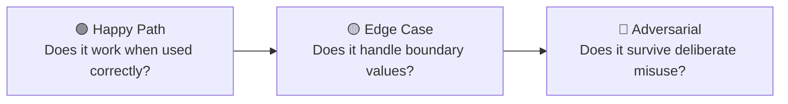
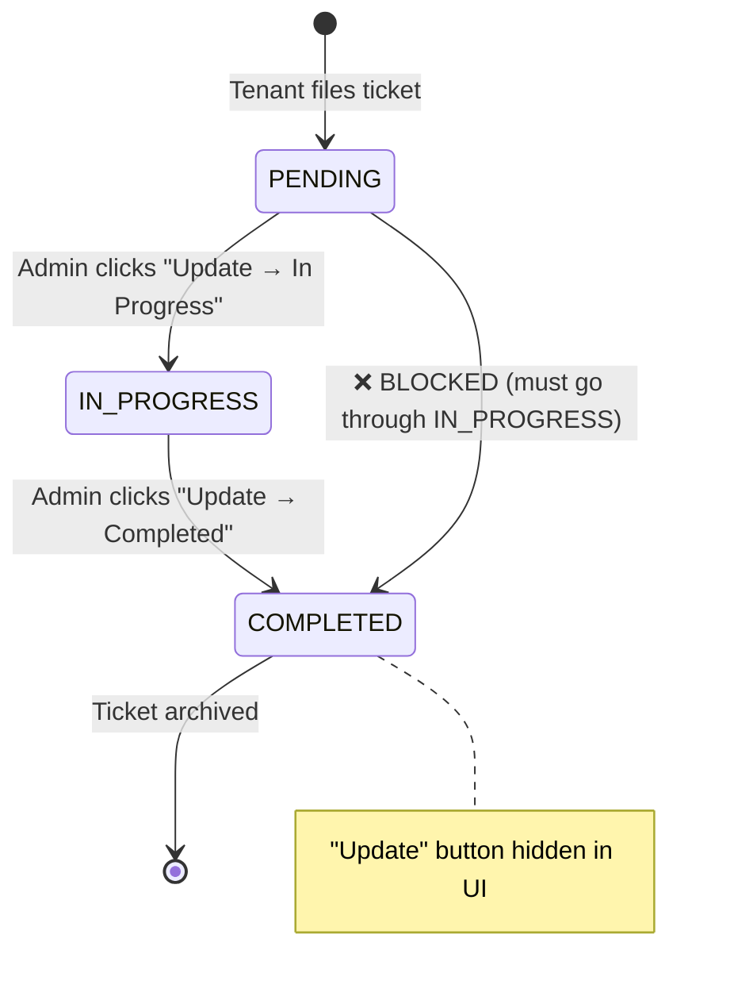

# THE RENTSPACE DASHBOARD — MASTER QA & MANUAL TESTING PROTOCOL

**Prepared By:** Senior QA Engineering Team
**Target Audience:** QA Engineers, Manual Testers, Product Managers, Developers
**Scope:** All 21 Dashboard Pages + Cross-Cutting Concerns + Security Penetration Tests
**Date:** March 2026

---

# TABLE OF CONTENTS

1. Testing Philosophy & Strategy
2. Environment Setup & Prerequisites
3. Dummy Data Seeding Playbook
4. Page-by-Page Test Matrices (21 pages)
5. Cross-Cutting Verification Suite
6. Security Penetration Tests
7. Performance & Stress Tests
8. Senior Engineering Suggestions (No Code Changes)

---

# CHAPTER 1: TESTING PHILOSOPHY & STRATEGY

## Why Manual Testing?

Automated tests verify that code works as the **developer intended**. Manual testing verifies that the product works as the **user expects**. These are fundamentally different goals.

**Layman Analogy:** Imagine you build a car. Automated tests check that the engine starts, the brakes work, the lights turn on. Manual testing checks whether a real human can comfortably sit in the driver's seat, see the road clearly, and reach the gear stick without straining.

## The Three Testing Lenses

Every interactive element must be tested through three lenses:



| Lens | Example on /rent page |
|------|----------------------|
| **Happy Path** | Click "Manual Payment" → enter ₹15,000 → submit → payment recorded ✅ |
| **Edge Case** | Enter ₹0.01 → does the UI break? Enter ₹99,99,999 → does formatting work? |
| **Adversarial** | Open Postman → send the same payment request twice rapidly → is only one recorded? |

## Test Result Recording

For every test case, record:

| Field | Description |
|-------|-------------|
| **Status** | ✅ Pass / ❌ Fail / ⚠️ Partial |
| **Screenshot** | Capture the exact screen state |
| **Console Errors** | Any red errors in Chrome DevTools Console |
| **Network Tab** | HTTP status code + response body for API calls |
| **Notes** | Describe any unexpected behavior |

---

# CHAPTER 2: ENVIRONMENT SETUP & PREREQUISITES

## Required Setup Checklist

| # | Requirement | How to Verify |
|---|-----------|---------------|
| 1 | Backend running on `localhost:5000` | `curl http://localhost:5000/health` returns `200 OK` |
| 2 | Frontend running on `localhost:3000` | Open browser → login page renders |
| 3 | PostgreSQL connected | Prisma Studio: `npx prisma studio` opens without errors |
| 4 | Redis connected | Backend logs show "Redis ready" |
| 5 | SuperAdmin account seeded | `npm run seed:admin` executed |
| 6 | Test data seeded | `npm run seed:test-data` executed |
| 7 | Chrome DevTools open | F12 → Network tab + Console tab visible |

## Login Credentials for Testing

| Role | Email | Purpose |
|------|-------|---------|
| SUPER_ADMIN | `dev@rentlyf.com` | Full access — tests all features |
| SUPPORT (if exists) | `support@rentlyf.com` | Tests RBAC restrictions |

---

# CHAPTER 3: DUMMY DATA SEEDING PLAYBOOK

## 3.1 Account Seeding Strategy

We need **100+ Accounts** with carefully distributed attributes:

```json
{
  "distribution": {
    "ACTIVE": 60,
    "SUSPENDED": 15,
    "CHURNED": 15,
    "TRIAL": 10
  },
  "churnRiskScores": {
    "0-20 (healthy)": 40,
    "21-50 (moderate)": 30,
    "51-80 (at-risk)": 20,
    "81-100 (critical)": 10
  },
  "createdAt_spread": "2023-01-01 to 2026-03-01 (3 years)"
}
```

**Why this distribution?**
- The 60/15/15/10 split ensures all status filters on `/accounts` show meaningful data
- The churn score spread tests the `ChurnRiskBadge` color gradient (emerald → amber → red)
- The 3-year date spread populates the `/growth` cohort heatmap across multiple quarters

**Edge Case Accounts to Inject:**

| Name | Status | Churn Score | Purpose |
|------|--------|-------------|---------|
| `Alpha Properties LLC` | ACTIVE | 5 | Healthy "whale" account with 50+ properties |
| `Zombie Real Estate` | SUSPENDED | 100 | Tests max churn score rendering |
| `Empty Shell Corp` | ACTIVE | 0 | Account with ZERO properties — tests empty states |
| `Unicode ← → ™ Props` | ACTIVE | 50 | Tests special character rendering in tables |
| `A` | ACTIVE | 25 | Single-character name — tests minimum-width column |

## 3.2 Property & Unit Matrix

**Distribution:**

| Type | Count | Units/Property | Purpose |
|------|-------|---------------|---------|
| APARTMENT | 40 | 10–50 units each | High-density testing |
| PG | 25 | 5–20 beds each | Bed-level tracking |
| HOSTEL | 15 | 10–30 rooms each | Room-level tracking |
| COMMERCIAL | 5 | 1 unit each, ₹5,00,000 rent | Tests INR formatting at high values |

**Edge Case Properties:**

| Property | Why |
|----------|-----|
| Property with 0 units | Tests empty unit count display |
| Property with ₹5,00,000 monthly rent | Tests [formatINR()](file:///d:/Techwara/rentspace-dashboard/src/features/analytics/components/payment-analytics-tab.tsx#17-18) with large numbers |
| Property named `'DROP TABLE properties;--` | SQL injection test (Prisma parameterizes, but verify the UI renders it safely) |

## 3.3 Rent Payment Seeding

Inject **5,000+ RentPayment records** across all tenants:

| Status | Count | Purpose |
|--------|-------|---------|
| PAID | 3,000 | Normal completed payments |
| DUE | 800 | Current month unpaid |
| OVERDUE | 500 | Past due — tests overdue highlighting |
| PARTIALLY_PAID | 200 | Tests partial payment math |

**Critical Edge Cases:**

| Scenario | Values | Purpose |
|----------|--------|---------|
| ₹1 delta | rentAmount=15000, paidAmount=14999 | Tests float precision (JS: `0.1+0.2 ≠ 0.3`) |
| Zero amount | rentAmount=0 | Tests division-by-zero in collection rate % |
| Massive amount | rentAmount=999999 | Tests INR formatter doesn't break table width |

## 3.4 Maintenance, Support & Move-Out Seeding

| Entity | Count | Status Distribution |
|--------|-------|-------------------|
| MaintenanceQuery | 200 | 40% PENDING, 30% IN_PROGRESS, 30% COMPLETED |
| OwnerQuery (Support) | 150 | 50% PENDING, 30% RESOLVED, 20% CANCELLED |
| MoveOutRequest | 80 | 40% PENDING, 30% APPROVED, 20% DECLINED, 10% COMPLETED |
| Suggestion | 50 | Mixed statuses |

---

# CHAPTER 4: PAGE-BY-PAGE TEST MATRICES

## Test Matrix Legend

- 🟢 = Happy path test
- 🟡 = Edge case test
- 🔴 = Adversarial/security test
- **Action** = What the tester physically does
- **Expected** = What MUST happen
- **Verify** = Where to check (UI / Network Tab / Console / Database)

---

## PAGE 1: Overview (`/overview`)

**Components:** [OverviewClient](file:///d:/Techwara/rentspace-dashboard/src/features/analytics/components/overview-client.tsx#21-60) → `AlertBanner`, [KPICards](file:///d:/Techwara/rentspace-dashboard/src/features/analytics/components/kpi-cards.tsx#10-83) (7 cards), `StatusCards`, `OverviewCharts`
**API:** `GET /admin/api/analytics/overview?period=monthly`

| # | Type | Test | Action | Expected | Verify |
|---|------|------|--------|----------|--------|
| 1 | 🟢 | KPI Cards render | Navigate to /overview | 7 KPI cards show with correct values: Total Accounts, Active, Properties, Tenants, Revenue, Subscriptions, Users | UI |
| 2 | 🟢 | Charts render | Scroll down | AreaChart + BarChart + PieChart render without blank spaces | UI |
| 3 | 🟢 | Loading skeleton | Throttle network to Slow 3G | Skeleton placeholders appear (7 cards + chart area), no layout jank | UI |
| 4 | 🟡 | Error state | Disconnect backend | Red `<Alert variant="destructive">` shows: "Failed to fetch the overview data" | UI |
| 5 | 🟡 | Dynamic import | Check Network tab | `overview-charts` chunk loads separately (code splitting works) | Network |
| 6 | 🟡 | Empty database | Clear all test data | Cards show `0` values, charts show empty state | UI |
| 7 | 🔴 | Unauthenticated access | Remove JWT from localStorage → refresh | Redirected to /login | URL bar |

---

## PAGE 2: Growth Analytics (`/growth`)

**Components:** [GrowthClient](file:///d:/Techwara/rentspace-dashboard/src/features/analytics/components/growth-client.tsx#19-134) → `GrowthKPICards`, Tabs: [GrowthCharts](file:///d:/Techwara/rentspace-dashboard/src/features/analytics/components/growth-charts.tsx#15-103) | `CohortHeatmap` | `TrialConversionFunnel` | `MultiAccountTable`
**APIs:** [useGrowthAnalytics(period)](file:///d:/Techwara/rentspace-dashboard/src/features/analytics/api/use-growth-analytics.ts#18-27), [useCohortAnalysis](file:///d:/Techwara/rentspace-dashboard/src/features/analytics/api/use-growth-analytics.ts#48-57), [useTrialConversion](file:///d:/Techwara/rentspace-dashboard/src/features/analytics/api/use-growth-analytics.ts#74-83), [useMultiAccountUsers](file:///d:/Techwara/rentspace-dashboard/src/features/analytics/api/use-growth-analytics.ts#103-112)

| # | Type | Test | Action | Expected | Verify |
|---|------|------|--------|----------|--------|
| 1 | 🟢 | Period selector | Click Daily → Weekly → Monthly | Charts reload with correct time buckets | UI + Network |
| 2 | 🟢 | Tab switching | Click each of 4 tabs | Correct sub-component renders, others unmount | UI |
| 3 | 🟢 | Export button | Click "Export Data" | Export action triggers (CSV download or toast) | UI |
| 4 | 🟡 | Rapid period toggle | Click Daily→Monthly→Daily→Weekly in 1 second | No race condition — final chart matches last selection | Network (only 1 in-flight request) |
| 5 | 🟡 | Cohort with sparse data | Only 2 months of account data | Heatmap renders partial grid without crashing | UI |
| 6 | 🟡 | Multi-account edge | User with 5+ accounts | MultiAccountTable row renders correctly | UI |

---

## PAGE 3: Revenue & Billing (`/revenue`)

**Components:** [RevenueClient](file:///d:/Techwara/rentspace-dashboard/src/features/analytics/components/revenue-client.tsx#20-141) → `RevenueKPICards`, 5 Tabs: Revenue | Payments | Rent Revisions | Reconciliation | Rent Cycle
**APIs:** 5 separate hooks, each lazily loaded per tab

| # | Type | Test | Action | Expected | Verify |
|---|------|------|--------|----------|--------|
| 1 | 🟢 | KPI Cards | Load page | Total Revenue ₹, Collection Rate %, Overdue ₹, Avg Rent ₹ display correctly with INR formatting | UI |
| 2 | 🟢 | All 5 tabs | Click each tab | Content loads with skeleton → data transition | UI |
| 3 | 🟡 | Revenue with ₹0 | No payments in DB | KPIs show ₹0, Collection Rate shows 0% (not NaN or Infinity) | UI |
| 4 | 🟡 | Reconciliation mismatch | Inject payment where collected ≠ expected | Reconciliation tab highlights discrepancy | UI |
| 5 | 🔴 | Period manipulation | Change period param in URL to `period=INVALID` | Backend returns 400 Zod error, UI shows error state | Network |

---

## PAGE 4: Subscriptions (`/subscriptions`)

| # | Type | Test | Action | Expected | Verify |
|---|------|------|--------|----------|--------|
| 1 | 🟢 | Plan distribution | Load page | Pie/Donut chart shows Free vs Pro vs Enterprise | UI |
| 2 | 🟢 | Trial funnel | Scroll to funnel | Shows Trial → Active → Churned stages | UI |
| 3 | 🟡 | All on Free plan | Set all accounts to Free | Pie chart shows 100% single color, funnel shows 0 conversions | UI |

---

## PAGE 5: Accounts (`/accounts`)

**Components:** [AccountsClient](file:///d:/Techwara/rentspace-dashboard/src/features/accounts/components/accounts-client.tsx#16-258), [AccountsTable](file:///d:/Techwara/rentspace-dashboard/src/features/accounts/components/accounts-table.tsx#22-147), `AccountActions`, `ChurnRisk`, `ChurnRiskBadge`
**Modals (4):** AddNoteModal, ChurnScoreModal, CsvImportModal, StatusOverrideModal
**Mutations (6):** useAddNote, useUpdateChurn, useUpdateStatus, useBulkAction, useImportCsv, useImpersonate

| # | Type | Test | Action | Expected | Verify |
|---|------|------|--------|----------|--------|
| 1 | 🟢 | Search | Type "Alpha" in search bar | Table filters to show "Alpha Properties LLC" | UI |
| 2 | 🟢 | Status filter | Click Active/Suspended/Churned tabs | Table shows only matching status | UI |
| 3 | 🟢 | Pagination | Click Next → Next → Prev | Page numbers update, correct 20 rows load | UI + Network |
| 4 | 🟢 | **Add Note** | Click row → Add Note → type "Test note" → Save | Toast: "Note added", note appears on profile | UI |
| 5 | 🟢 | **Churn Score** | Click churn badge → set to 90 → Save | Badge turns red, score updates | UI |
| 6 | 🟢 | **Status Override** | Click menu → Override → select SUSPENDED → Save | Status badge changes to amber, audit log created | UI + DB |
| 7 | 🟢 | **CSV Import** | Upload valid CSV file | Progress indicator, success toast, table refreshes | UI |
| 8 | 🟢 | **Bulk Activate** | Select 3 SUSPENDED accounts → Bulk Actions → Activate | All 3 become ACTIVE, toast confirms | UI |
| 9 | 🟡 | CSV Import — bad file | Upload CSV missing required columns | Red error toast with validation message | UI |
| 10 | 🟡 | Note overflow | Paste 10,000 characters into note | Either Zod rejects with max-length error OR it saves and UI truncates with `...` | UI + Network |
| 11 | 🟡 | Search with special chars | Type `<script>alert(1)</script>` | Text renders as literal string, no XSS execution | UI |
| 12 | 🔴 | Double-click bulk | Click "Activate" twice rapidly | Button disables after 1st click (`isPending`), only 1 API call sent | Network |

---

## PAGE 6: Account Detail (`/accounts/[id]`)

| # | Type | Test | Action | Expected | Verify |
|---|------|------|--------|----------|--------|
| 1 | 🟢 | Profile load | Click account row | Detail page shows full profile, properties, notes | UI |
| 2 | 🟡 | Invalid ID | Navigate to `/accounts/nonexistent-id` | Error state or 404 page, not white screen | UI |
| 3 | 🟡 | Empty account | View "Empty Shell Corp" (0 properties) | "No properties" empty state renders | UI |

---

## PAGE 7: Properties (`/properties`)

**Components:** [PropertiesClient](file:///d:/Techwara/rentspace-dashboard/src/features/platform/components/properties-client.tsx#25-140), inline [PropertyRow](file:///d:/Techwara/rentspace-dashboard/src/features/platform/components/properties-client.tsx#141-185)
**Modal:** Transfer Ownership (accountId + reason)

| # | Type | Test | Action | Expected | Verify |
|---|------|------|--------|----------|--------|
| 1 | 🟢 | KPI Cards | Load page | Properties, Units, Beds, Occupancy% render correctly | UI |
| 2 | 🟢 | Type filter | Select PG → Hostel → All | Table filters by property type | UI |
| 3 | 🟢 | **Transfer** | Click Transfer → enter valid Account ID + reason → Submit | Ownership transferred, toast confirms | UI |
| 4 | 🟡 | Transfer — empty fields | Leave Account ID blank | Submit button disabled (client guard) | UI |
| 5 | 🟡 | Transfer — invalid ID | Enter `fake-id-12345` | Backend returns 404, toast shows error | Network |
| 6 | 🟡 | High-value property | Find ₹5,00,000 rent property | INR formatting shows `₹5,00,000` not `₹500000` | UI |
| 7 | 🔴 | Transfer to same owner | Transfer property to its current owner | Backend should reject or handle gracefully | Network |

---

## PAGE 8: Tenants (`/tenants`)

| # | Type | Test | Action | Expected | Verify |
|---|------|------|--------|----------|--------|
| 1 | 🟢 | List loads | Navigate to /tenants | Tenant list with names, phone, property renders | UI |
| 2 | 🟢 | Status filter | Select Active/Past | Shows matching lease status | UI |
| 3 | 🟡 | Extend lease | Enter 12 months → Submit | Lease end date extends by 12 months | UI |
| 4 | 🟡 | Extend — over max | Enter `999` months | Zod `.max(36)` rejects with inline error | UI |
| 5 | 🟡 | Extend — zero | Enter `0` months | Zod `.min(1)` rejects | UI |

---

## PAGE 9: Rent Ledger (`/rent`)

**Modals:** Manual Payment, Waive Charges, Mark as Paid
**RBAC:** Manual Payment wrapped in `<RoleGate action="rent:manual-payment">`

| # | Type | Test | Action | Expected | Verify |
|---|------|------|--------|----------|--------|
| 1 | 🟢 | KPI Cards | Load page | Due ₹, Overdue ₹, Collected ₹, Collection % display | UI |
| 2 | 🟢 | Status filter | Click DUE → PAID → OVERDUE → ALL | Table filters correctly | UI |
| 3 | 🟢 | **Manual Payment** | Click Pay → ₹15,000 + UPI + ref123 → Submit | Payment recorded, status changes, toast confirms | UI |
| 4 | 🟢 | **Mark as Paid** | Click Mark Paid on a DUE row | Status → PAID, row updates | UI |
| 5 | 🟢 | **Waive Charges** | Click Waive → enter reason → Submit | Late fee removed, audit log | UI |
| 6 | 🟡 | Negative payment | Enter `-5000` as amount | Zod `.positive()` rejects | UI |
| 7 | 🟡 | Partial payment math | Pay ₹14,999 on ₹15,000 rent | Status → PARTIALLY_PAID, remaining = ₹1 | UI |
| 8 | 🟡 | Zero collection rate | All rents DUE, none paid | Collection Rate shows `0%` not `NaN%` | UI |
| 9 | 🔴 | Idempotent Mark Paid | Open /rent in 2 tabs → Mark same rent PAID in both simultaneously | Only 1 payment recorded, 2nd gets "Already paid" error | Network + DB |
| 10 | 🔴 | RBAC bypass | Login as SUPPORT → inspect element → unhide Pay button → click | Backend returns 403 Forbidden | Network |

---

## PAGE 10: Maintenance (`/maintenance`)

**Modal:** Update Status (new status + optional note)
**State Machine:** PENDING → IN_PROGRESS → COMPLETED

| # | Type | Test | Action | Expected | Verify |
|---|------|------|--------|----------|--------|
| 1 | 🟢 | KPI Cards | Load page | Total, Pending, In Progress, Completed counts correct | UI |
| 2 | 🟢 | Filters | Test Search, Status, Issue Type filters | Table filters correctly for each | UI |
| 3 | 🟢 | **Update Status** | Click Update → IN_PROGRESS → add note → Submit | Status updates, table refreshes | UI |
| 4 | 🟡 | COMPLETED row | Find a completed ticket | No "Update" button shown (UI rule) | UI |
| 5 | 🟡 | Empty note | Update status without note | Succeeds (note is optional) | UI |
| 6 | 🔴 | State bypass | Intercept PATCH request → change status to `DECLINED` | Zod rejects — only PENDING/IN_PROGRESS/COMPLETED allowed | Network |



---

## PAGE 11: Move-Outs (`/move-outs`)

**Modals (2):** Approve (optional note), Decline (required reason + optional note)

| # | Type | Test | Action | Expected | Verify |
|---|------|------|--------|----------|--------|
| 1 | 🟢 | KPI Cards | Load page | Total, Pending, Approved, Declined counts | UI |
| 2 | 🟢 | **Approve** | Click ✅ → add note → Approve | Status → APPROVED, toast confirms | UI |
| 3 | 🟢 | **Decline** | Click ❌ → enter reason + note → Decline | Status → DECLINED, toast confirms | UI |
| 4 | 🟡 | Decline without reason | Leave reason blank | Submit button disabled | UI |
| 5 | 🟡 | Non-PENDING actions | Find APPROVED row | No Approve/Decline buttons visible | UI |
| 6 | 🟡 | Reason labels | Check dropdown values | Rent Increase, Family Reasons, Job Transfer, Shifting City, Other | UI |

---

## PAGE 12: Support (`/support`)

**Modals (3):** Respond 💬, Close ✕, Assign 👤+

| # | Type | Test | Action | Expected | Verify |
|---|------|------|--------|----------|--------|
| 1 | 🟢 | KPI Cards | Load page | Total, Pending, Resolved counts | UI |
| 2 | 🟢 | **Respond** | Click 💬 → type response → Send | Query resolved, toast confirms | UI |
| 3 | 🟢 | **Close** | Click ✕ → add note → Close | Query cancelled | UI |
| 4 | 🟢 | **Assign** | Click 👤+ → enter admin ID → Assign | Query assigned | UI |
| 5 | 🟡 | Respond empty | Leave response blank | Button disabled | UI |
| 6 | 🟡 | Assign invalid | Enter `fake-admin-id` | Backend error, toast shows failure | Network |
| 7 | 🟡 | Resolved row | Find RESOLVED query | No action buttons visible | UI |
| 8 | 🟢 | Type filter | Select Billing/Technical/Feature | Correct filtering | UI |

---

## PAGE 13: Suggestions (`/support/suggestions`)

| # | Type | Test | Action | Expected | Verify |
|---|------|------|--------|----------|--------|
| 1 | 🟢 | List loads | Navigate to page | Suggestions from landlords render | UI |
| 2 | 🟡 | Empty state | No suggestions in DB | "No suggestions found" message | UI |

---

## PAGE 14: Plans (`/plans`)

**Components:** `PlansClient`, [PlansTable](file:///d:/Techwara/rentspace-dashboard/src/features/plans/components/plans-table.tsx#11-91), `QuickBillingActions`, `TenantPlanManagement`

| # | Type | Test | Action | Expected | Verify |
|---|------|------|--------|----------|--------|
| 1 | 🟢 | Plans list | Load page | Free, Pro, Enterprise plans with pricing | UI |
| 2 | 🟢 | KPI area | Check subscription counts | Matches actual subscription data | UI |
| 3 | 🟡 | Plan with 0 subscribers | Create new plan | Shows plan with 0 active subscribers | UI |

---

## PAGE 15: Platform Analytics (`/platform`)

| # | Type | Test | Action | Expected | Verify |
|---|------|------|--------|----------|--------|
| 1 | 🟢 | Charts render | Load page | Platform-wide charts with tooltips | UI |
| 2 | 🟢 | Multi-account table | Scroll down | Shows accounts with health indicators | UI |

---

## PAGE 16: Users (`/users`)

**Components:** `UsersClient`, `UsersTable`, `UserProfilePanel`, `UserActions`
**Modals:** EditUserModal, MergeUsersModal
**Mutations:** useUpdateUser, useForceLogout, useResetPassword, useMergeUsers

| # | Type | Test | Action | Expected | Verify |
|---|------|------|--------|----------|--------|
| 1 | 🟢 | Search | Type user name | Filters user list | UI |
| 2 | 🟢 | **Profile Panel** | Click user row | Slide-out panel shows initials avatar, contact, activity | UI |
| 3 | 🟢 | **Edit User** | Click Edit → modify name → Save | User updated, toast confirms | UI |
| 4 | 🟢 | **Force Logout** | Click Force Logout | User's sessions terminated | UI |
| 5 | 🟢 | **Reset Password** | Click Reset Password | Confirmation dialog → password reset | UI |
| 6 | 🟡 | **Merge Users** | Select 2 users → Merge | Users merged into one, audit trail created | UI |
| 7 | 🟡 | Merge same user | Try to merge user with themselves | Error: "Cannot merge user with self" | UI |
| 8 | 🔴 | Edit without auth | Remove JWT → try edit API via Postman | 401 Unauthorized | Network |

---

## PAGE 17: Admin Users (`/admin-users`)

**Tabs:** Admin Users | Audit Log
**RBAC Gate:** `<RoleGate action="admin:create">` on "+ Add Admin"

| # | Type | Test | Action | Expected | Verify |
|---|------|------|--------|----------|--------|
| 1 | 🟢 | Admin list | Load Admins tab | Shows all admins with Name, Email, Role badge, Status, Last Login | UI |
| 2 | 🟢 | **Create Admin** | Click "+ Add Admin" → fill Name+Email+Password → Create | New admin appears in table | UI |
| 3 | 🟢 | Audit Log tab | Click "Audit Log" tab | Shows immutable log: admin name, action code, target, IP, timestamp | UI |
| 4 | 🟢 | Audit filter | Type action name in filter | Table filters by action | UI |
| 5 | 🟡 | Create with existing email | Use already-registered email | Backend rejects with "Email already exists" | Network |
| 6 | 🟡 | Weak password | Enter "123" as password | Zod `.min(8)` rejects | UI |
| 7 | 🔴 | **RBAC Gate Test** | Login as SUPPORT_ADMIN | "+ Add Admin" button NOT in DOM (RoleGate blocks) | Inspector |
| 8 | 🔴 | **RBAC Bypass** | As SUPPORT, use DevTools to unhide button → fill form → submit | Backend returns `403 Forbidden` | Network |

---

## PAGE 18: Staff (`/staff`)

| # | Type | Test | Action | Expected | Verify |
|---|------|------|--------|----------|--------|
| 1 | 🟢 | Staff list | Load page | Shows landlord staff members with roles | UI |
| 2 | 🟢 | Filters | Apply status/role filters | Correct filtering | UI |

---

## PAGE 19: Alerts (`/alerts`)

**Components:** `AlertsClient`, `AlertsMetricCards`, `AlertsTable`
**Bulk Actions:** Mark Read, Resolve Selected

| # | Type | Test | Action | Expected | Verify |
|---|------|------|--------|----------|--------|
| 1 | 🟢 | Metric Cards | Load page | Total Active, Critical count render | UI |
| 2 | 🟢 | Severity filters | Click Critical → Warning → Info → All | Table filters by severity | UI |
| 3 | 🟢 | Status toggles | Click Unread → Read → Resolved → All | Table filters by status | UI |
| 4 | 🟢 | **Select + Resolve** | Check 3 alerts → "Resolve Selected" | All 3 resolved, checkboxes clear | UI |
| 5 | 🟢 | **Select All + Mark Read** | Check "Select All" → "Mark all as read" | All page alerts marked read | UI |
| 6 | 🟡 | Empty state | Set filters that match 0 alerts | `<EmptyState>` with Bell icon renders | UI |
| 7 | 🟡 | No selection actions | Click "Resolve Selected" with 0 selected | Button disabled | UI |
| 8 | 🔴 | Alert flood | Seed 10,000 alerts | Table paginated at 15/page, doesn't crash | UI + Network |

---

## PAGE 20: Notifications (`/notifications`)

**Components:** `NotificationsClient`, BroadcastDialog, DeliveryTab, HistoryTab
**Modals:** Send Broadcast (5 channel toggles), Recall Broadcast

| # | Type | Test | Action | Expected | Verify |
|---|------|------|--------|----------|--------|
| 1 | 🟢 | **Send Broadcast** | Click "New Broadcast" → fill title+message → select IN_APP+EMAIL → Send | Broadcast created, table refreshes | UI |
| 2 | 🟢 | All channel toggles | Toggle each of 5 channels (IN_APP/EMAIL/SMS/PUSH/WHATSAPP) | Selected channels highlighted green | UI |
| 3 | 🟢 | Category + Severity | Set Category=PAYMENT, Severity=HIGH | Sent with correct metadata | Network |
| 4 | 🟢 | Delivery Analytics | Load Delivery tab | KPIs: Total/Delivered/Failed/Pending + Channel Breakdown | UI |
| 5 | 🟢 | History Log | Load History tab + search | Shows past notifications with category and delivery count | UI |
| 6 | 🟢 | **Recall** | Click Recall → enter Group Key + reason → Recall | Broadcast recalled | UI |
| 7 | 🟡 | Send with no channels | Deselect all 5 channels | Submit button disabled (`channels.length === 0`) | UI |
| 8 | 🟡 | Send empty title | Leave title blank | Submit button disabled (`!title`) | UI |
| 9 | 🟡 | Recall invalid key | Enter non-existent group key | Backend 404, toast error | Network |
| 10 | 🔴 | RBAC check | Verify Broadcast button is inside `<RoleGate action="notification:broadcast">` | SUPPORT role cannot see it | Inspector |

---

## PAGE 21: Settings (`/settings`)

| # | Type | Test | Action | Expected | Verify |
|---|------|------|--------|----------|--------|
| 1 | 🟢 | System health | Load page | Shows API status, DB status, Redis status indicators | UI |
| 2 | 🟢 | **Clear Cache** | Click Clear Cache → Confirm | Redis flushed, navigate to /overview → slower load (cache miss) | UI + Timing |
| 3 | 🟢 | Audit logs | Browse audit history | Shows immutable action history with pagination | UI |
| 4 | 🟡 | Cache already empty | Clear cache twice | Second clear succeeds gracefully (idempotent) | UI |

---

## PAGE 22: Reports (`/reports`)

**Components:** `ReportsClient` — Report Builder (1/3) + Results (2/3)
**10 Metrics:** Revenue, Subscriptions, Accounts, Properties, Tenants, Rent Payments, Maintenance, Move-Outs, Support Queries, Suggestions

| # | Type | Test | Action | Expected | Verify |
|---|------|------|--------|----------|--------|
| 1 | 🟢 | Generate report | Select Revenue+Accounts → set dates → Group by Month → Generate | Results panel shows metric cards with ₹ amounts and counts | UI |
| 2 | 🟢 | All 10 metrics | Check all 10 checkboxes → Generate | All 10 appear in results grid | UI |
| 3 | 🟢 | Group by options | Try Day/Week/Month/Quarter/Year | Results grouped correctly | UI |
| 4 | 🟡 | No metrics selected | Deselect all checkboxes | Generate button disabled | UI |
| 5 | 🟡 | Future date range | Set From=2030-01-01, To=2030-12-31 | Results show 0 counts (no data in future) | UI |
| 6 | 🟡 | Empty state | No report generated yet | Large BarChart2 icon + "Select metrics and generate a report" | UI |
| 7 | 🔴 | Giant date range | From=2000-01-01 to To=2030-12-31 | Backend handles without timeout (pagination/limits) | Network |

---

# CHAPTER 5: CROSS-CUTTING VERIFICATION SUITE

These tests apply across ALL pages:

| # | Test | Action | Expected |
|---|------|--------|----------|
| 1 | **Responsive Layout** | Resize browser to 375px (mobile width) | Tables scroll horizontally, sidebar collapses, cards stack vertically |
| 2 | **Loading Skeletons** | Throttle to Slow 3G → navigate to any page | Skeleton placeholders render, no raw text flashing |
| 3 | **Error Boundaries** | Throw JS error in console → refresh | `error.tsx` boundary catches crash, shows recovery UI |
| 4 | **Browser Back/Forward** | Navigate Overview → Accounts → Growth → Press Back twice | Returns to Accounts → Overview correctly |
| 5 | **Token Expiry** | Wait for JWT to expire (or manually delete from localStorage) | Next API call redirects to /login |
| 6 | **Concurrent Tabs** | Open same page in 2 tabs → make mutation in Tab A | Tab B reflects change on next refocus (TanStack refetchOnWindowFocus) |
| 7 | **Console Errors** | Open DevTools Console on every page | Zero red errors, zero unhandled promise rejections |
| 8 | **Network 404** | Navigate to `/nonexistent-page` | Next.js 404 page renders, not a white screen |

---

# CHAPTER 6: SECURITY PENETRATION TESTS

| # | Test | Action | Expected |
|---|------|--------|----------|
| 1 | **Rate Limiter** | Send 11 rapid POST requests to `/admin/api/auth/login` with wrong passwords | 11th request returns `429 Too Many Requests` |
| 2 | **JWT Blocklist** | Login → copy JWT → Logout → use old JWT in Postman | Returns `401: Admin token has been revoked` |
| 3 | **XSS via Search** | Type `` in any search bar | Renders as literal text, no script execution |
| 4 | **SQL Injection** | Type `'; DROP TABLE accounts; --` in search | Prisma parameterizes query, no DB impact, search returns 0 results |
| 5 | **RBAC Escalation** | As SUPPORT user, send POST to `/admin/api/users` via Postman | 403 Forbidden |
| 6 | **Missing Auth Header** | Send GET to `/admin/api/platform/accounts` with no Authorization header | 401 Unauthorized |
| 7 | **Tampered JWT** | Modify JWT payload in Postman (change role from SUPPORT to SUPER_ADMIN) | 401: Invalid admin token (signature mismatch) |
| 8 | **Expired Token** | Use a token issued 25 hours ago | 401: Admin token has expired |

---

# CHAPTER 7: PERFORMANCE & STRESS TESTS

| # | Test | Action | Expected |
|---|------|--------|----------|
| 1 | **Cache miss latency** | Clear Redis → load /overview | Takes ~300-500ms (Prisma aggregation) |
| 2 | **Cache hit latency** | Load /overview again (within 5 minutes) | Takes <50ms (Redis cache hit) |
| 3 | **Large table rendering** | Load /accounts with 100 accounts | Table renders in <200ms, no jank |
| 4 | **Report generation** | Generate report with ALL 10 metrics + 3-year range | Completes in <5 seconds |
| 5 | **Pagination stress** | Click Next 50 times rapidly on /rent | No duplicate requests, correct page loads each time |

---

# CHAPTER 8: SENIOR ENGINEERING SUGGESTIONS

> [!IMPORTANT]
> These are architectural observations discovered during the audit. **No code changes should be made now** — these are logged for future sprint planning.

## Suggestion 1: Add Debounced Search

**Observation:** Search inputs on pages like `/accounts`, `/tenants`, `/maintenance` fire a new API request on every keystroke (`onChange` → `setSearch` → TanStack refetch).

**Risk:** Typing "Alpha Properties" = 16 HTTP requests in 2 seconds.

**Recommendation:** Wrap search inputs with a 300ms debounce using `useDeferredValue` or a custom `useDebounce` hook. This would reduce 16 requests to 1.

## Suggestion 2: Add Confirmation Dialogs for Destructive Actions

**Observation:** Bulk actions like "Suspend 5 Accounts" and "Clear Cache" execute immediately after one click.

**Risk:** Accidental mass suspension with no undo mechanism.

**Recommendation:** Add a `<ConfirmDialog>` step that says "Are you sure you want to suspend 5 accounts? This action cannot be undone." before executing the mutation.

## Suggestion 3: Add Toast Notifications for All Mutations

**Observation:** Not all mutation hooks show success/error toasts. Some silently succeed or fail.

**Recommendation:** Standardize all `useMutation` hooks to include `onSuccess: () => toast.success("...")` and `onError: (err) => toast.error(err.message)`.

## Suggestion 4: Add Optimistic Updates for Status Changes

**Observation:** When changing a maintenance ticket from PENDING → IN_PROGRESS, the UI waits for the server response before updating. This feels sluggish.

**Recommendation:** Use TanStack Query's `onMutate` to optimistically update the local cache before the server confirms, rolling back if the mutation fails.

## Suggestion 5: Add Export/Download for Data Tables

**Observation:** Pages like `/accounts`, `/rent`, `/maintenance` show paginated tables but have no way to export the full dataset.

**Recommendation:** Add a "Download CSV" button that calls a dedicated `/export` endpoint returning all rows as a downloadable CSV stream.

## Suggestion 6: Add Empty State Consistency

**Observation:** Some pages use `<EmptyState>` component (`/alerts`), while others just render `<p>No data found</p>` (`/maintenance`, `/support`).

**Recommendation:** Standardize all empty states to use the `<EmptyState icon={...} title="..." description="..." />` pattern for visual consistency.

## Suggestion 7: Add Error Retry Buttons

**Observation:** When API calls fail, the error alert shows a message but no "Retry" button. The user must manually refresh the browser.

**Recommendation:** Add a "Try Again" button inside the error `<Alert>` that calls `refetch()` from TanStack Query.

## Suggestion 8: Add Audit Log Linking

**Observation:** Audit logs show `targetType: "Account"` and `targetId: "clhq123..."` but these aren't clickable. The admin can't navigate to the affected entity.

**Recommendation:** Make `targetId` a hyperlink that routes to the entity's detail page (e.g., `/accounts/clhq123...`).

---

*END OF QA PROTOCOL — Execute all test cases sequentially, page by page, recording Pass/Fail results for every row.*
